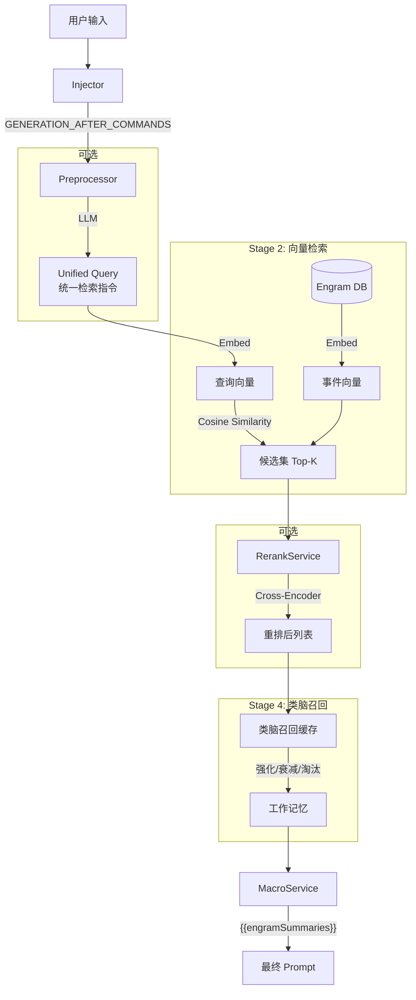

# Engram RAG 召回系统完全指南 (RAG Retrieval System Guide)

> **Version**: V1.4
> **Last Modified**: 2026-01-28

## 1. 系统概述 (Overview)

Engram V0.9.5 的 RAG (Retrieval-Augmented Generation) 召回系统旨在解决角色扮演场景下常见的「检索鸿沟」问题——即用户输入的短文本（动作、简短对话）与长篇剧情记忆（详细叙事、环境描写）之间在语义密度和表达方式上的巨大差异。

本系统采用多阶段混合检索架构，结合了 LLM 预处理、向量检索 (Embedding)、重排序 (Rerank) 和**类脑召回缓存 (BrainRecallCache)**，以提供精准且连贯的记忆召回体验。

## 2. 核心架构 (Core Architecture)

整个召回流程是一个精密的 Pipeline，包含四个主要阶段：



### 关键组件

| 组件 | 文件路径 | 职责 |
|------|----------|------|
| **Injector** | `src/modules/rag/injection/Injector.ts` | 监听酒馆事件，阻塞生成流程，协调预处理和召回 |
| **Preprocessor** | `src/modules/preprocessing/Preprocessor.ts` | 利用 LLM 分析用户意图，生成 Unified Query |
| **EmbeddingService** | `src/modules/rag/embedding/EmbeddingService.ts` | 处理文本向量化，支持多并发和批处理 |
| **RerankService** | `src/modules/rag/retrieval/Reranker.ts` | 对初步召回结果进行精细化语义重排序 |
| **BrainRecallCache** | `src/modules/rag/retrieval/BrainRecallCache.ts` | **V0.9.5 核心**：类脑记忆缓存系统 |
| **Retriever** | `src/modules/rag/retrieval/Retriever.ts` | 统一检索服务，编排上述所有组件 |

## 3. 召回模式 (Recall Modes)

系统提供四种预设模式，以适应不同用户的硬件条件和 API 预算：

| 模式 | 组件组合 | 特点 | 适用场景 |
|:-----|:---------|:-----|:---------|
| **Full (顶配)** | 预处理 + Embed + Rerank | 效果最优，成本最高，延迟最高 | 追求极致体验，Token 充足 |
| **Standard (标准)** | Embed + Rerank | 性价比平衡，由 Embed 广撒网，Rerank 精选 | 大多数用户的首选 |
| **Light (轻量)** | 仅 Embedding | 速度最快，成本低，仅需向量模型 | 本地运行或预算有限 |
| **Brute Force (暴力)** | 滚动窗口 | 无需向量模型，返回最近 N 条事件 | 无法部署向量模型的环境 |

**Query 来源说明**：
- **Light/Standard**: 由于无预处理，系统使用**用户原始输入**作为查询词
- **Full**: 系统优先使用预处理生成的 **Unified Query**

## 4. 关键技术特性 (Key Features)

### 4.1 Unified Query (统一检索指令)

为了弥补「用户输入」与「剧情文本」的鸿沟，Full 模式下的预处理器会将用户输入转化为多种维度的检索指令：

- **因果指令**: 查找导致当前动作的前因后果
- **视觉指令**: 查找相关的环境和外观描写
- **实体指令**: 查找提及的物品或人物背景
- **情感指令**: 查找类似的情感交互历史

### 4.2 混合打分 (Hybrid Scoring)

当同时启用 Embedding 和 Rerank 时，系统使用加权公式计算最终相关度：

```typescript
HybridScore = (1 - α) * EmbeddingScore + α * RerankScore
```

- **EmbeddingScore**: 基于余弦相似度，擅长捕捉字面和浅层语义相关性
- **RerankScore**: 基于 Cross-Encoder 模型，擅长理解深层逻辑关系
- **α (hybridAlpha)**: 混合权重，可配置。默认 `0.5` 表示两者同等重要

### 4.3 类脑召回系统 (BrainRecallCache) 🧠

> **V1.4 算法更新** (2026-01-28)

这是 Engram 的核心记忆进化，模拟人脑的「越回忆越细节」特点：

#### 4.3.1 核心设计理念

> **💡 关键理解**: 类脑召回的核心是「填满优先」，只有在池子满了之后才启动优胜劣汰。它的本质是把多余的、不那么相关的条目“挤”出去，而不是主动设置一个“斑杀线”。

```
归档事件库 (IndexedDB)
        │
        ▼
┌─────────────────────────────────────────┐
│     Embedding + Rerank 统一打分          │
│     (所有事件都参与，包括已在缓存的)        │
└─────────────────────────────────────────┘
        │
        ├──────────────────────────────────┐
        ▼                                  ▼
┌─────────────────────┐          ┌─────────────────────┐
│  已在缓存池的条目     │          │  不在缓存池的新候选   │
│  ───────────────────│          │  ───────────────────│
│  • 参与打分           │          │  • 参与打分           │
│  • 内部优胜劣汰       │          │  • 竞争注入缓存       │
└─────────────────────┘          └─────────────────────┘
        │                                  │
        └──────────────┬───────────────────┘
                       ▼
              ┌─────────────────┐
              │   短期记忆池 (STM)    │
              │   (主干事件)        │
              └─────────────────┘
                       │
                       ▼ Top-K (填满优先)
              ┌─────────────────┐
              │  工作记忆 (WM)      │
              │  (输出给 LLM)       │
              └─────────────────┘
```

#### 4.3.2 核心设计原则

| 原则 | 说明 |
|------|------|
| **填满优先** | 工作记忆 (WM) 不满时，全部进入；只有满了才优胜劣汰 |
| **基于容量淘汰** | 不设“斑杀线”，而是在超出容量时淘汰分数最低的 |
| **剧情连贯性** | 剧情事件有时间和逻辑联系，相似度高是正常的 |

#### 4.3.3 双轨存储机制

**1. 双轨存储 (Dual Track Storage)**
- **`embeddingStrength` (潜意识)**: 代表"氛围感"和"字面相关性"。衰减慢，作为保底。
- **`rerankStrength` (显意识)**: 代表"逻辑焦点"。爆发强，衰减快。

**2. 门控强化 (Gated Reinforcement)**
- 只有 `RerankScore > gateThreshold` (默认 0.6) 时才强化
- 确保只有逻辑相关的内容才能占据注意力焦点

**3. 柔性阻尼 (Soft Damping)**
- 单次强化幅度受 `maxDamping` 限制
- 记忆需要 2-3 轮持续确认才能建立

**4. Sigmoid 激活**
- 通过 S 曲线拉开分数差距，让 AI 的注意力更加爱憎分明

### 4.4 可观测性 (Recall Logs)

在开发者面板 (DevLog) 中新增了 **Recall** 标签页，提供：

- 每次召回的完整快照 (Query, Timestamp, Latency)
- Embedding 和 Rerank 分数的直观对比条
- 类脑召回系统的状态可视化 (短期记忆大小、平均强度等)

## 5. 配置指南 (Configuration)

### 5.1 启用 RAG

前往 `API 配置` -> `Engram RAG` 面板：

1. **启用开关**: 打开 "启用 RAG 召回系统"
2. **选择模式**: 推荐从 "Standard" 开始

### 5.2 向量模型设置

在 `API 配置` -> `向量化` 面板：

| 配置项 | 说明 |
|--------|------|
| **源** | 支持 `Transformers.js` (本地)、OpenAI、Ollama、vLLM、Cohere、Jina、Voyage 等 |
| **模型** | 推荐 `text-embedding-3-small` 或本地 `bge-m3` |
| **API URL** | 部分源需要填写端点地址 |
| **API Key** | 部分源需要填写密钥 |

### 5.3 Rerank 设置

在 `API 配置` -> `Rerank` 面板：

| 配置项 | 说明 |
|--------|------|
| **URL** | Rerank API 端点 |
| **Model** | 推荐 BGE-Reranker 或 Cohere API |
| **Top-N** | Rerank 后保留的精选条目数（建议 5-10） |
| **hybridAlpha** | 混合权重 (0-1) |

### 5.4 类脑召回配置 (V1.4)

| 配置项 | 默认值 | 说明 |
|--------|--------|------|
| `enabled` | `true` | 是否启用类脑召回 |
| `workingLimit` | `10` | 工作记忆容量 |
| `shortTermLimit` | `35` | 短期记忆容量 |
| `reinforceFactor` | `0.2` | 强化系数 |
| `decayRate` | `0.08` | 衰减速率 |
| `contextSwitchThreshold` | `0.4` | 上下文切换阈值 |
| `gateThreshold` | `0.6` | 门控阈值，Rerank > 此值才强化 |
| `maxDamping` | `0.15` | 单次强化最大增量 |
| `sigmoidTemperature` | `0.25` | Sigmoid 温度系数（越小越陡） |
| `boredomThreshold` | `5` | 连续进入 WM 多少次触发厌倦惩罚 |
| `boredomPenalty` | `0.1` | 厌倦时的额外扣分 |
| `newcomerBoost` | `0.2` | 新记忆的初始加成 |

> ℹ️ **V1.4 简化**: 移除了 `evictionThreshold` 和 `mmrThreshold`，改为基于容量的优胜劣汰。

## 6. 开发接口 (Developer API)

### 核心服务

| 服务 | 说明 |
|------|------|
| `retriever` | 单例对象，通过 `retriever.search()` 执行召回 |
| `brainRecallCache` | 类脑缓存单例，管理记忆强化/衰减/淘汰 |
| `MacroService` | 负责将召回结果注入到 `{{engramSummaries}}` |

### 宏接口

剧情 AI 的 Prompt Template 中可以使用以下宏接收召回内容：

- `{{engramSummaries}}`: 包含当前轮次召回并格式化好的记忆片段

## 7. 版本历史

| 版本 | 变更 |
|------|------|
| **V1.4** | 类脑召回算法重构：填满优先、基于容量淘汰、移除 MMR |
| V1.2 | 双轨存储机制、门控强化、Sigmoid 激活 |
| V0.9.5 | 新增 BrainRecallCache，替代 StickyCache |
| V0.8.5 | 引入混合检索架构 (Embed + Rerank) |
