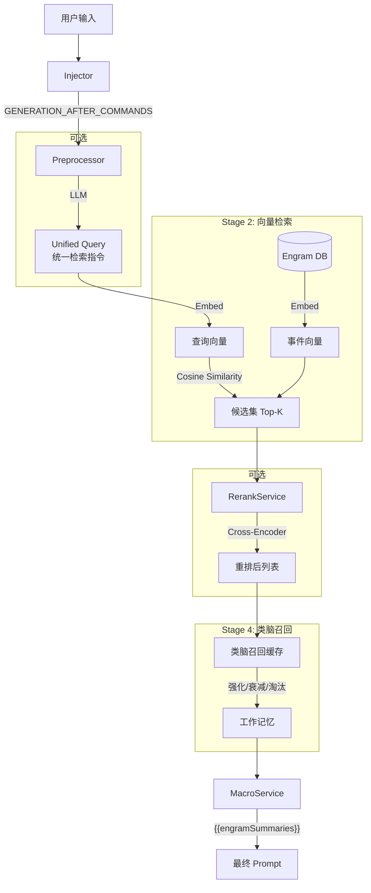
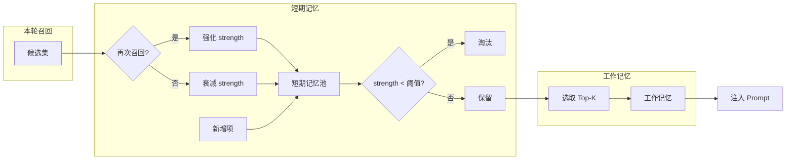

# Engram RAG 召回系统完全指南 (RAG Retrieval System Guide)

> **Version**: V0.9.5
> **Last Modified**: 2026-01-21

## 1. 系统概述 (Overview)

Engram V0.9.5 的 RAG (Retrieval-Augmented Generation) 召回系统旨在解决角色扮演场景下常见的「检索鸿沟」问题——即用户输入的短文本（动作、简短对话）与长篇剧情记忆（详细叙事、环境描写）之间在语义密度和表达方式上的巨大差异。

本系统采用多阶段混合检索架构，结合了 LLM 预处理、向量检索 (Embedding)、重排序 (Rerank) 和**类脑召回缓存 (BrainRecallCache)**，以提供精准且连贯的记忆召回体验。

## 2. 核心架构 (Core Architecture)

整个召回流程是一个精密的 Pipeline，包含四个主要阶段：



### 关键组件

| 组件 | 文件路径 | 职责 |
|------|----------|------|
| **Injector** | `src/modules/rag/injection/Injector.ts` | 监听酒馆事件，阻塞生成流程，协调预处理和召回 |
| **Preprocessor** | `src/modules/preprocessing/Preprocessor.ts` | 利用 LLM 分析用户意图，生成 Unified Query |
| **EmbeddingService** | `src/modules/rag/embedding/EmbeddingService.ts` | 处理文本向量化，支持多并发和批处理 |
| **RerankService** | `src/modules/rag/retrieval/Reranker.ts` | 对初步召回结果进行精细化语义重排序 |
| **BrainRecallCache** | `src/modules/rag/retrieval/BrainRecallCache.ts` | **V0.9.5 核心**：类脑记忆缓存系统 |
| **Retriever** | `src/modules/rag/retrieval/Retriever.ts` | 统一检索服务，编排上述所有组件 |

## 3. 召回模式 (Recall Modes)

系统提供四种预设模式，以适应不同用户的硬件条件和 API 预算：

| 模式 | 组件组合 | 特点 | 适用场景 |
|:-----|:---------|:-----|:---------|
| **Full (顶配)** | 预处理 + Embed + Rerank | 效果最优，成本最高，延迟最高 | 追求极致体验，Token 充足 |
| **Standard (标准)** | Embed + Rerank | 性价比平衡，由 Embed 广撒网，Rerank 精选 | 大多数用户的首选 |
| **Light (轻量)** | 仅 Embedding | 速度最快，成本低，仅需向量模型 | 本地运行或预算有限 |
| **Brute Force (暴力)** | 滚动窗口 | 无需向量模型，返回最近 N 条事件 | 无法部署向量模型的环境 |

**Query 来源说明**：
- **Light/Standard**: 由于无预处理，系统使用**用户原始输入**作为查询词
- **Full**: 系统优先使用预处理生成的 **Unified Query**

## 4. 关键技术特性 (Key Features)

### 4.1 Unified Query (统一检索指令)

为了弥补「用户输入」与「剧情文本」的鸿沟，Full 模式下的预处理器会将用户输入转化为多种维度的检索指令：

- **因果指令**: 查找导致当前动作的前因后果
- **视觉指令**: 查找相关的环境和外观描写
- **实体指令**: 查找提及的物品或人物背景
- **情感指令**: 查找类似的情感交互历史

### 4.2 混合打分 (Hybrid Scoring)

当同时启用 Embedding 和 Rerank 时，系统使用加权公式计算最终相关度：

```typescript
HybridScore = (1 - α) * EmbeddingScore + α * RerankScore
```

- **EmbeddingScore**: 基于余弦相似度，擅长捕捉字面和浅层语义相关性
- **RerankScore**: 基于 Cross-Encoder 模型，擅长理解深层逻辑关系
- **α (hybridAlpha)**: 混合权重，可配置。默认 `0.5` 表示两者同等重要

### 4.3 类脑召回系统 (BrainRecallCache) 🧠

> **V0.9.5 实验性特性**

这是 Engram 最核心的记忆管理机制，模拟人脑的记忆模型：

#### 4.3.1 双层记忆结构

| 层级 | 容量 | 说明 |
|------|------|------|
| **短期记忆 (Short-Term Memory)** | `shortTermLimit` (默认 50) | 存储近几轮被召回过的记忆槽位 |
| **工作记忆 (Working Memory)** | `workingLimit` (默认 10) | 从短期记忆中选取强度最高的 Top-K，注入到 Prompt |

#### 4.3.2 核心机制



| 机制 | 公式/逻辑 | 配置项 |
|------|-----------|--------|
| **强化 (Reinforce)** | `strength = strength + factor * (1 - strength)` (饱和增长) | `reinforceFactor` |
| **衰减 (Decay)** | `strength = strength - decayRate` (线性衰减) | `decayRate` |
| **淘汰 (Eviction)** | 当 `strength < evictionThreshold` 时移出短期记忆 | `evictionThreshold` |
| **上下文切换检测** | 当召回结果与短期记忆几乎无重叠时，执行 `softReset` 清空短期记忆 | `contextSwitchThreshold` |

#### 4.3.3 设计理念

- **记忆惯性**: 连续被召回的记忆会越来越"顽固"，难以被替换，模拟真实对话中的话题延续性
- **自然遗忘**: 不再相关的记忆会逐渐衰减直至淘汰，避免陈旧信息"刷屏"
- **话题敏感**: 当检测到话题切换时，主动清空短期记忆，避免旧话题干扰新话题

### 4.4 可观测性 (Recall Logs)

在开发者面板 (DevLog) 中新增了 **Recall** 标签页，提供：

- 每次召回的完整快照 (Query, Timestamp, Latency)
- Embedding 和 Rerank 分数的直观对比条
- 类脑召回系统的状态可视化 (短期记忆大小、平均强度等)

## 5. 配置指南 (Configuration)

### 5.1 启用 RAG

前往 `API 配置` -> `Engram RAG` 面板：

1. **启用开关**: 打开 "启用 RAG 召回系统"
2. **选择模式**: 推荐从 "Standard" 开始

### 5.2 向量模型设置

在 `API 配置` -> `向量化` 面板：

| 配置项 | 说明 |
|--------|------|
| **源** | 支持 `Transformers.js` (本地)、OpenAI、Ollama、vLLM、Cohere、Jina、Voyage 等 |
| **模型** | 推荐 `text-embedding-3-small` 或本地 `bge-m3` |
| **API URL** | 部分源需要填写端点地址 |
| **API Key** | 部分源需要填写密钥 |

### 5.3 Rerank 设置

在 `API 配置` -> `Rerank` 面板：

| 配置项 | 说明 |
|--------|------|
| **URL** | Rerank API 端点 |
| **Model** | 推荐 BGE-Reranker 或 Cohere API |
| **Top-N** | Rerank 后保留的精选条目数（建议 5-10） |
| **hybridAlpha** | 混合权重 (0-1) |

### 5.4 类脑召回配置 (V0.9.5)

| 配置项 | 默认值 | 说明 |
|--------|--------|------|
| `enabled` | `true` | 是否启用类脑召回 |
| `workingLimit` | `10` | 工作记忆容量 |
| `shortTermLimit` | `50` | 短期记忆容量 |
| `reinforceFactor` | `0.3` | 再次召回的强化系数 |
| `decayRate` | `0.05` | 每轮衰减速率 |
| `evictionThreshold` | `0.1` | 淘汰阈值 |
| `contextSwitchThreshold` | `0.3` | 上下文切换检测阈值 |

## 6. 开发接口 (Developer API)

### 核心服务

| 服务 | 说明 |
|------|------|
| `retriever` | 单例对象，通过 `retriever.search()` 执行召回 |
| `brainRecallCache` | 类脑缓存单例，管理记忆强化/衰减/淘汰 |
| `MacroService` | 负责将召回结果注入到 `{{engramSummaries}}` |

### 宏接口

剧情 AI 的 Prompt Template 中可以使用以下宏接收召回内容：

- `{{engramSummaries}}`: 包含当前轮次召回并格式化好的记忆片段

## 7. 版本历史

| 版本 | 变更 |
|------|------|
| V0.9.5 | 新增 **BrainRecallCache** 类脑召回系统，替代旧版 StickyCache |
| V0.8.5 | 引入混合检索架构 (Embedding + Rerank) |
