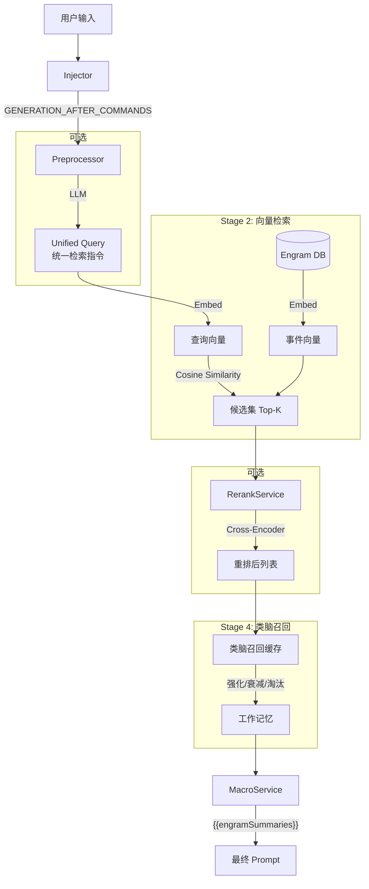

# Engram RAG 召回系统完全指南 (RAG Retrieval System Guide)

> **Version**: V0.9.5
> **Last Modified**: 2026-01-21

## 1. 系统概述 (Overview)

Engram V0.9.5 的 RAG (Retrieval-Augmented Generation) 召回系统旨在解决角色扮演场景下常见的「检索鸿沟」问题——即用户输入的短文本（动作、简短对话）与长篇剧情记忆（详细叙事、环境描写）之间在语义密度和表达方式上的巨大差异。

本系统采用多阶段混合检索架构，结合了 LLM 预处理、向量检索 (Embedding)、重排序 (Rerank) 和**类脑召回缓存 (BrainRecallCache)**，以提供精准且连贯的记忆召回体验。

## 2. 核心架构 (Core Architecture)

整个召回流程是一个精密的 Pipeline，包含四个主要阶段：



### 关键组件

| 组件 | 文件路径 | 职责 |
|------|----------|------|
| **Injector** | `src/modules/rag/injection/Injector.ts` | 监听酒馆事件，阻塞生成流程，协调预处理和召回 |
| **Preprocessor** | `src/modules/preprocessing/Preprocessor.ts` | 利用 LLM 分析用户意图，生成 Unified Query |
| **EmbeddingService** | `src/modules/rag/embedding/EmbeddingService.ts` | 处理文本向量化，支持多并发和批处理 |
| **RerankService** | `src/modules/rag/retrieval/Reranker.ts` | 对初步召回结果进行精细化语义重排序 |
| **BrainRecallCache** | `src/modules/rag/retrieval/BrainRecallCache.ts` | **V0.9.5 核心**：类脑记忆缓存系统 |
| **Retriever** | `src/modules/rag/retrieval/Retriever.ts` | 统一检索服务，编排上述所有组件 |

## 3. 召回模式 (Recall Modes)

系统提供四种预设模式，以适应不同用户的硬件条件和 API 预算：

| 模式 | 组件组合 | 特点 | 适用场景 |
|:-----|:---------|:-----|:---------|
| **Full (顶配)** | 预处理 + Embed + Rerank | 效果最优，成本最高，延迟最高 | 追求极致体验，Token 充足 |
| **Standard (标准)** | Embed + Rerank | 性价比平衡，由 Embed 广撒网，Rerank 精选 | 大多数用户的首选 |
| **Light (轻量)** | 仅 Embedding | 速度最快，成本低，仅需向量模型 | 本地运行或预算有限 |
| **Brute Force (暴力)** | 滚动窗口 | 无需向量模型，返回最近 N 条事件 | 无法部署向量模型的环境 |

**Query 来源说明**：
- **Light/Standard**: 由于无预处理，系统使用**用户原始输入**作为查询词
- **Full**: 系统优先使用预处理生成的 **Unified Query**

## 4. 关键技术特性 (Key Features)

### 4.1 Unified Query (统一检索指令)

为了弥补「用户输入」与「剧情文本」的鸿沟，Full 模式下的预处理器会将用户输入转化为多种维度的检索指令：

- **因果指令**: 查找导致当前动作的前因后果
- **视觉指令**: 查找相关的环境和外观描写
- **实体指令**: 查找提及的物品或人物背景
- **情感指令**: 查找类似的情感交互历史

### 4.2 混合打分 (Hybrid Scoring)

当同时启用 Embedding 和 Rerank 时，系统使用加权公式计算最终相关度：

```typescript
HybridScore = (1 - α) * EmbeddingScore + α * RerankScore
```

- **EmbeddingScore**: 基于余弦相似度，擅长捕捉字面和浅层语义相关性
- **RerankScore**: 基于 Cross-Encoder 模型，擅长理解深层逻辑关系
- **α (hybridAlpha)**: 混合权重，可配置。默认 `0.5` 表示两者同等重要

### 4.3 类脑召回系统 (BrainRecallCache) 🧠

> **V1.2 算法更新** (2026-01-25)

这是 Engram V1.2 的核心记忆进化，模拟人脑的「潜意识」与「显意识」双轨机制：

#### 4.3.1 核心流程 (Mermaid)

```mermaid
graph TD
    classDef input fill:#e1f5fe,stroke:#01579b,stroke-width:2px;
    classDef process fill:#fff9c4,stroke:#fbc02d,stroke-width:2px;
    classDef decision fill:#e8f5e9,stroke:#2e7d32,stroke-width:2px,rhombus;
    classDef memory fill:#f3e5f5,stroke:#7b1fa2,stroke-width:2px;

    Input[输入: Embedding分 & Rerank分]:::input --> DualTrack

    subgraph DualTrack [双轨处理机制]
        direction TB
        Embedding[Embedding分] -->|潜意识通道| Base[Embedding Strength<br/>衰减慢·保底]
        Rerank[Rerank分] -->|显意识通道| Gate{Rerank > Gate?}:::decision
        
        Gate -->|Yes| Boost[Rerank Strength += 强化增量<br/>(受 Damping 限制)]:::process
        Gate -->|No| Decay[Rerank Strength 衰减]:::process
        
        Base --> Mix
        Boost --> Mix
        Decay --> Mix
    end
    
    Mix[混合计算]:::process -->|Sigmoid(非线性映射)| FinalScore[最终得分]:::process
    FinalScore --> STM[短期记忆池]:::memory
    
    subgraph Output
        STM -->|Top-K| WorkingMemory[工作记忆]:::memory
    end
```

#### 4.3.2 关键算法解释

**1. 双轨存储 (Dual Track Storage)**
我们将记忆强度拆分为两个独立的维度：
- **`embeddingStrength` (潜意识)**: 代表"氛围感"和"字面相关性"。它的特点是**只能被动刷新，衰减极慢**。即使逻辑暂时跟不上，它也能作为保底，防止话题彻底断片。
- **`rerankStrength` (显意识)**: 代表"逻辑焦点"。它的特点是**爆发力强，衰减快**。只有它能显著提升记忆的最终得分。

**2. 门控强化 (Gated Reinforcement)**
为了防止"一本正经的胡说八道"被强化，我们引入了门控机制：
- **规则**: 只有当 `RerankScore > gateThreshold` (默认 0.6) 时，才允许强化 `rerankStrength`。
- **目的**: 确保只有逻辑上真正相关的内容才能占据你的注意力焦点。

**3. 柔性阻尼 (Soft Damping)**
为了避免"强者恒强"的马太效应：
- **规则**: `rerankStrength` 单次增强幅度被 `maxDamping` (默认 0.1) 钳制。
- **效果**: 记忆的建立需要经过 2-3 轮的持续确认，而不是跳变。

**4. Sigmoid 激活**
最终分数不再是简单的加权平均，而是通过 S 曲线映射：
$$ Final = Sigmoid\left( \frac{0.7 \cdot R_{str} + 0.3 \cdot E_{str} - 0.5}{Temperature} \right) $$
- **效果**: 也就是把分数"拉开"。高分更高，低分更低，让 AI 的注意力更加爱憎分明。

### 4.4 可观测性 (Recall Logs)

在开发者面板 (DevLog) 中新增了 **Recall** 标签页，提供：

- 每次召回的完整快照 (Query, Timestamp, Latency)
- Embedding 和 Rerank 分数的直观对比条
- 类脑召回系统的状态可视化 (短期记忆大小、平均强度等)

## 5. 配置指南 (Configuration)

### 5.1 启用 RAG

前往 `API 配置` -> `Engram RAG` 面板：

1. **启用开关**: 打开 "启用 RAG 召回系统"
2. **选择模式**: 推荐从 "Standard" 开始

### 5.2 向量模型设置

在 `API 配置` -> `向量化` 面板：

| 配置项 | 说明 |
|--------|------|
| **源** | 支持 `Transformers.js` (本地)、OpenAI、Ollama、vLLM、Cohere、Jina、Voyage 等 |
| **模型** | 推荐 `text-embedding-3-small` 或本地 `bge-m3` |
| **API URL** | 部分源需要填写端点地址 |
| **API Key** | 部分源需要填写密钥 |

### 5.3 Rerank 设置

在 `API 配置` -> `Rerank` 面板：

| 配置项 | 说明 |
|--------|------|
| **URL** | Rerank API 端点 |
| **Model** | 推荐 BGE-Reranker 或 Cohere API |
| **Top-N** | Rerank 后保留的精选条目数（建议 5-10） |
| **hybridAlpha** | 混合权重 (0-1) |

### 5.4 类脑召回配置 (V1.2)

| 配置项 | 默认值 | 说明 |
|--------|--------|------|
| `enabled` | `true` | 是否启用类脑召回 |
| `workingLimit` | `10` | 工作记忆容量 |
| `shortTermLimit` | `50` | 短期记忆容量 |
| `reinforceFactor` | `0.2` | 强化系数 base |
| `decayRate` | `0.08` | 衰减速率 |
| `evictionThreshold` | `0.25` | 淘汰阈值 (低于此分直接移除) |
| `contextSwitchThreshold` | `0.4` | 上下文切换阈值 (Embedding 相似比) |
| `gateThreshold` | `0.6` | **(V1.2)** 门控阈值，Rerank > 此值才强化 |
| `maxDamping` | `0.1` | **(V1.2)** 单次强化最大增量 |
| `sigmoidTemperature` | `0.15` | **(V1.2)** Sigmoid 温度系数 |

## 6. 开发接口 (Developer API)

### 核心服务

| 服务 | 说明 |
|------|------|
| `retriever` | 单例对象，通过 `retriever.search()` 执行召回 |
| `brainRecallCache` | 类脑缓存单例，管理记忆强化/衰减/淘汰 |
| `MacroService` | 负责将召回结果注入到 `{{engramSummaries}}` |

### 宏接口

剧情 AI 的 Prompt Template 中可以使用以下宏接收召回内容：

- `{{engramSummaries}}`: 包含当前轮次召回并格式化好的记忆片段

## 7. 版本历史

| 版本 | 变更 |
|------|------|
| V0.9.5 | 新增 **BrainRecallCache** 类脑召回系统，替代旧版 StickyCache |
| V0.8.5 | 引入混合检索架构 (Embedding + Rerank) |
