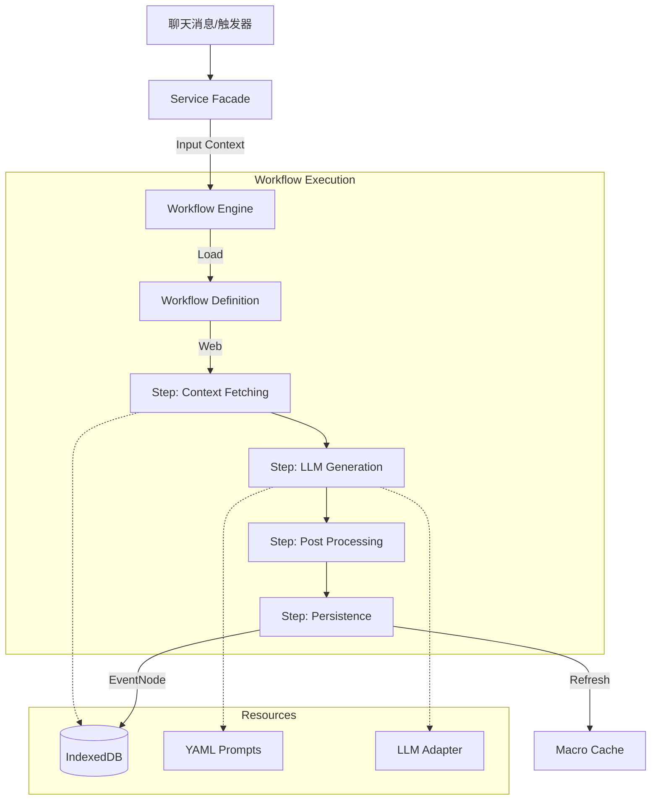

# Engram 系统流程架构 V0.9.9

> **最后更新**: 2026-01-18 (Layered Modular Architecture)

## 1. 核心设计理念

### 1.1 数据双重性 (Dual-Nature Data)
数据以两种形态存在：
- **For Machine (JSON)**: 结构化的 `structured_kv`，用于过滤、索引和图谱构建
- **For Model (Text)**: `summary` 高密度文本，用于 Embedding 和 LLM 上下文

### 1.2 IndexedDB 优先 (IndexedDB-First)
- 所有数据存储在 IndexedDB (`EngramDB`)
- WorldBook 仅用于宏占位 (`{{engramSummaries}}`)
- 不再写入 WorldBook 条目

### 1.3 蓝灯/绿灯可见性 (V0.7.1)
类似酒馆世界书的触发机制：

| 状态 | 字段值 | 含义 | 可见性 |
|------|--------|------|--------|
| 🔵 **蓝灯** | `is_archived=false` | 常驻事件 | 始终显示在 `{{engramSummaries}}` |
| 🟢 **绿灯** | `is_archived=true` | 条件触发 | 仅当被 RAG 召回时临时显示 |

---

## 2. 核心组件 (Decoupled Architecture)

Engram 采用 **Service Facade -> Workflow Engine -> Steps** 的解耦架构。

### 2.1 Service Layer (Services)
- **位置**: `src/modules/*/Services` (如 `Summarizer.ts`, `EventTrimmer.ts`)
- **职责**: 业务入口，负责调度工作流。不包含具体业务逻辑。
- **模式**: Facade 模式。接收 UI/Event 请求，组装参数，调用 Workflow Engine。

### 2.2 Workflow Engine (Core)
- **位置**: `src/modules/workflow/core/WorkflowEngine.ts`
- **职责**: 工作流执行引擎。
- **功能**: 执行基于图 (Graph) 定义的 `GraphWorkflow`。管理 Step 依赖、并发执行和状态传递。

### 2.3 Workflow Definitions (Definitions)
- **位置**: `src/modules/workflow/definitions/*.ts` (如 `SummaryWorkflow.ts`, `EntityWorkflow.ts`)
- **职责**: 定义业务流程的拓扑结构 (Steps & Edges)。声明式的流程定义。

### 2.4 Workflow Steps (Steps)
- **位置**: `src/modules/workflow/steps/*`
- **职责**: 最小执行单元。
- **类型**:
    - **Context Steps**: 获取上下文 (如 `FetchChatHistory`)
    - **LLM Steps**: 调用 AI (如 `GenerateSummary`)
    - **Processing Steps**: 数据处理 (如 `CleanRegex`)
    - **Persistence Steps**: 数据库操作 (如 `SaveEvent`)

### 2.5 Prompt System (YAML)
- **位置**: `src/integrations/llm/prompts/*.yaml`
- **职责**: 统一管理所有提示词。
- **加载**: 通过 `PromptLoader` 加载，支持热更新。

---

## 3. 数据流 (Workflow-Based)



### 3.1 典型流程：总结 (Summarization)
1. **Trigger**: `SummarizerService` 收到新消息。
2. **Facade**: 调用 `WorkflowEngine.run(summaryWorkflow, input)`。
3. **Steps**:
   - `FetchChatHistory`: 从 DB 获取对话。
   - `GenerateSummary`: 加载 `summary.yaml`，调用 LLM。
   - `CleanRegex`: 使用 `RegexProcessor` 清洗。
   - `SaveEvent`: 存入 DB (Level 0)。

### 3.2 典型流程：实体提取 (Entity Extraction)
1. **Trigger**: `EntityExtractor` (Service) 触发。
2. **Facade**: 调用 `WorkflowEngine.run(entityWorkflow, input)`。
3. **Steps**:
   - `FetchValidText`: 获取用于提取的文本。
   - `ExtractEntities`: 加载 `entity_extraction.yaml`，调用 LLM。
   - `SaveEntity`: 存入/更新 EntityNode。

### 3.3 典型流程：精简 (Trimming)
1. **Trigger**: `EventTrimmer` 检测到 Token 超限。
2. **Step**: (目前 EventTrimmer 仍保留部分内部逻辑，未来将迁移至 Workflow)
   - 加载 `trim.yaml`。
   - 调用 LLM 压缩。
   - 保存 Level 1 节点。
   - 归档旧节点。

---

## 4. 事件聚合与排序

### 4.1 可见性过滤

```typescript
// memoryStore.getEventSummaries(recalledIds?)
const visibleEvents = events.filter(e =>
    e.level >= 1 ||                    // 大纲总是显示
    !e.is_archived ||                  // 蓝灯：未归档
    recalledSet?.has(e.id)             // 绿灯：被 RAG 召回
);
```

### 4.2 终极时序装配算法 (The -1ms Override, V1.5)

```typescript
// 彻底摒弃 Source_Range 与双层排位，利用毫秒级 Unix 物理时间独占占位
visibleEvents.sort((a, b) => {
    // 跨卷、融合多库的唯一王道属性：绝对发生时间
    // 逻辑：由于新生成的大纲 (LV1+) 在存储时将被强行截取它所属子节点中【最早时刻 - 1 毫秒】，
    // 大纲节点在排序中永远会如神谕般降临在其所有发生事件的最前方，且永不重叠越位。
    return a.timestamp - b.timestamp;
});
```

---

## 5. 数据结构

### 5.1 EventNode (V0.7+)

**V0.6+ 多数据库架构**: 每个 `chat_id` 独立数据库，不再需要 `scope_id`。

```typescript
// 定义位置: src/core/types/memory.ts (或 modules/memory/types.ts)
interface EventNode {
    id: string;               // UUID

    summary: string;          // For Model (烧录文本，用于 Embedding 和 RAG)
    structured_kv: {          // For Machine (结构化查询)
        time_anchor: string;
        role: string[];
        location: string;
        event: string;
        logic: string[];
        causality: string;
    };

    // 向量化
    embedding?: number[];     // 语义向量 (可选)
    is_embedded: boolean;     // 是否已向量化

    // 可见性控制
    is_archived: boolean;     // true=🟢绿灯(条件触发), false=🔵蓝灯(常驻)

    // 排序与层级
    level: number;            // 0=原始, 1+=精简层级
    source_range: { start_index: number; end_index: number };
    significance_score: number;
    timestamp: number;

    // 可选
    parent_id?: string;       // 父节点 (精简来源)
}
```

### 5.2 EntityNode & ScopeState

```typescript
// EntityNode - 实体节点
interface EntityNode {
    id: string;
    name: string;
    type: EntityType;         // 'char' | 'loc' | 'item' | 'concept' | 'unknown'
    aliases: string[];        // 别名列表 (MultiEntry索引)
    description: string;      // [For Model] YAML 烧录文本
    profile: Record<string, unknown>;  // [For Machine] 开放式 KV 容器
    last_updated_at: number;
    layout_x?: number;        // 图谱布局坐标
    layout_y?: number;
}

// ScopeState - 聊天状态
interface ScopeState {
    last_summarized_floor: number;
    token_usage_accumulated: number;
    last_compressed_at: number;
    active_summary_order: number;
    last_extracted_floor: number;
}
```

---

## 6. 关键文件索引

| 文件 | 职责 |
|------|------|
| `src/data/db.ts` | EngramDB (Dexie) 定义 |
| `src/data/ChatManager.ts` | 聊天状态管理 |
| `src/modules/workflow/core/WorkflowEngine.ts` | 业务逻辑编排引擎 |
| `src/modules/memory/EntityExtractor.ts` | 实体提取门面 |
| `src/modules/rag/retrieval/BrainRecallCache.ts` | 类脑召回池 (Working/ShortTerm Memory) |
| `src/state/memoryStore.ts` | Zustand 状态 + 可见性过滤 |
| `src/integrations/tavern/macros.ts` | 宏注册 + 缓存刷新 |
| `src/integrations/tavern/worldbook/index.ts` | 世界书同步集成服务 |

