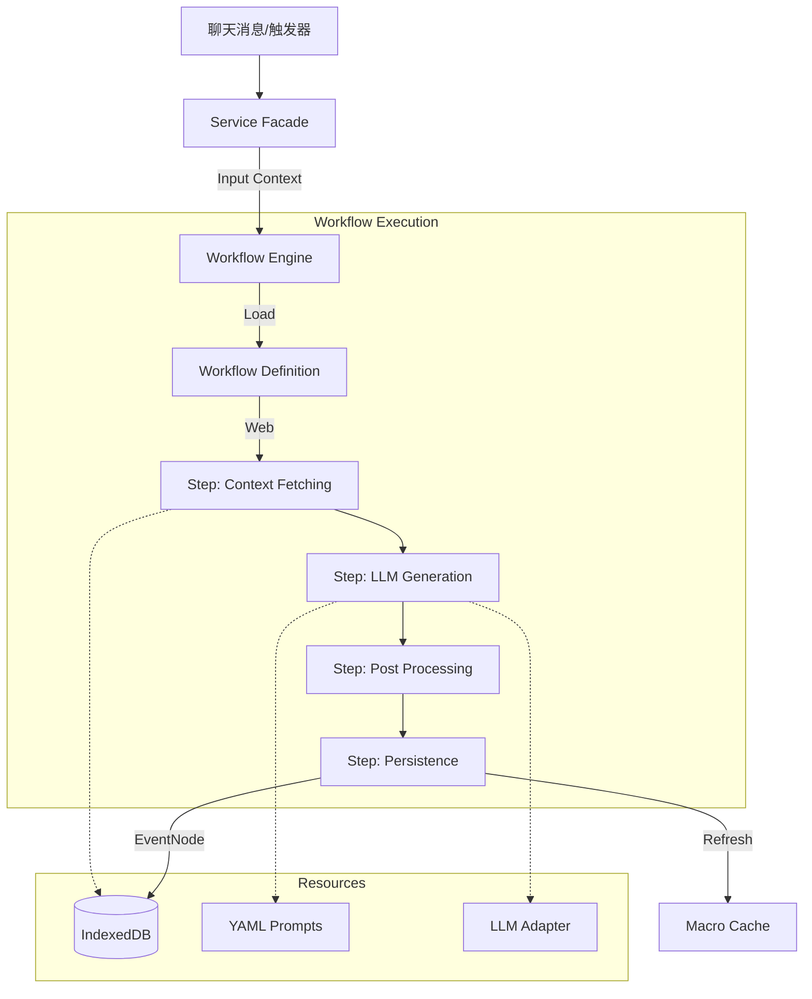

# Engram 系统流程架构 V0.9.9

> **最后更新**: 2026-01-18 (Layered Modular Architecture)

## 1. 核心设计理念

### 1.1 数据双重性 (Dual-Nature Data)
数据以两种形态存在：
- **For Machine (JSON)**: 结构化的 `structured_kv`，用于过滤、索引和图谱构建
- **For Model (Text)**: `summary` 高密度文本，用于 Embedding 和 LLM 上下文

### 1.2 IndexedDB 优先 (IndexedDB-First)
- 所有数据存储在 IndexedDB (`EngramDB`)
- WorldBook 仅用于宏占位 (`{{engramSummaries}}`)
- 不再写入 WorldBook 条目

### 1.3 蓝灯/绿灯可见性 (V0.7.1)
类似酒馆世界书的触发机制：

| 状态 | 字段值 | 含义 | 可见性 |
|------|--------|------|--------|
| 🔵 **蓝灯** | `is_archived=false` | 常驻事件 | 始终显示在 `{{engramSummaries}}` |
| 🟢 **绿灯** | `is_archived=true` | 条件触发 | 仅当被 RAG 召回时临时显示 |
| 🟠 **锁定** | (任何) | 关键锚点 | 强制不参与自动归档 (实体) 或 Trimming 合并 (事件) |

---

## 2. 核心组件 (Decoupled Architecture)

Engram 采用 **Service Facade -> Workflow Engine -> Steps** 的解耦架构。

### 2.1 Service Layer (Services)
- **位置**: `src/modules/*/Services` (如 `Summarizer.ts`, `EventTrimmer.ts`)
- **职责**: 业务入口，负责调度工作流。不包含具体业务逻辑。
- **模式**: Facade 模式。接收 UI/Event 请求，组装参数，调用 Workflow Engine。

### 2.2 Workflow Engine (Core)
- **位置**: `src/modules/workflow/core/WorkflowEngine.ts`
- **职责**: 工作流执行引擎。
- **功能**: 按序执行 `WorkflowDefinition` 中定义的 `Steps`。管理上下文 (`JobContext`) 的生成与状态传递，支持中途取消信号 (`signal.cancelled`)，并支持基于 Step 结果 (`finish`, `abort`, `jump`) 的控制流跳转（具备 `jump` 最大 50 次循环保护机制防止无限循环死锁）。同时在捕获异常时提供精准的断点记录（严格捕捉 `currentStepName`），以避免将异常的 `lastProcessFloor` 误报为成功步数。

### 2.3 Workflow Definitions (Definitions)
- **位置**: `src/modules/workflow/definitions/*.ts` (如 `SummaryWorkflow.ts`, `EntityWorkflow.ts`)
- **职责**: 定义业务流程的拓扑结构 (Steps & Edges)。声明式的流程定义。

### 2.4 Workflow Steps (Steps)
- **位置**: `src/modules/workflow/steps/*`
- **职责**: 最小执行单元。
- **类型**:
    - **Context Steps**: 获取上下文 (如 `FetchChatHistory`)
    - **LLM Steps**: 调用 AI (如 `GenerateSummary`)
    - **Processing Steps**: 数据处理 (如 `CleanRegex`)
    - **Persistence Steps**: 数据库操作 (如 `SaveEvent`)

### 2.5 Prompt System (YAML)
- **位置**: `src/integrations/llm/prompts/*.yaml`
- **职责**: 统一管理所有提示词。
- **加载**: 通过 `PromptLoader` 加载，支持热更新。

### 2.6 Batch Processor (批处理调度服务)
- **位置**: `src/modules/batch/`
- **职责**: 负责长程与高并发的后台批量处理。
- **机制**:
  - **Facade (`BatchProcessor.ts`)**: 作为外界调用的统一入口。
  - **Engine (`engine/BatchEngine.ts`)**: 专注于大吞吐量任务链的切片与防竞态、进度节流通知与局部错误宽容能力（支持软暂停、异步并发锁定），与关注流程编排的 Workflow Engine 分离。
  - **Tasks (`tasks/HistoryTask.ts` 等)**: 负责预估任务分布以及迭代执行具体的微切片任务，通过生成器 (Generators) 返还控制权给引擎。

---

## 3. 数据流 (Workflow-Based)


```mermaid
graph TD
    Input[聊天消息/触发器] --> Service[Service Facade]
    Service -->|Input Context| WF_Engine[Workflow Engine]

    subgraph "Workflow Execution"
        WF_Engine -->|Load| Def[Workflow Definition]
        Def -->|Web| Step1[Step: Context Fetching]
        Step1 --> Step2[Step: LLM Generation]
        Step2 --> Step3[Step: Post Processing]
        Step3 --> Step4[Step: Persistence]
    end

    subgraph "Resources"
        Step1 -.-> DB[(IndexedDB)]
        Step2 -.-> Prompts[YAML Prompts]
        Step2 -.-> LLM[LLM Adapter]
    end

    Step4 -->|EventNode| DB
    Step4 -->|Refresh| Macro[Macro Cache]
```

### 3.1 典型流程：总结 (Summarization)
1. **Trigger**: `SummarizerService` 收到新消息。
2. **Facade**: 调用 `WorkflowEngine.run(summaryWorkflow, input)`。
3. **Steps**:
   - `FetchChatHistory`: 从 DB 获取对话。
   - `GenerateSummary`: 加载 `summary.yaml`，调用 LLM。
   - `CleanRegex`: 使用 `RegexProcessor` 清洗。
   - `SaveEvent`: 存入 DB (Level 0)，包含将因果链 (causality) 与逻辑标签 (logic) 烧录至标题后缀的机制。

### 3.2 典型流程：实体提取 (Entity Extraction)
1. **Trigger**: `EntityExtractor` (Service) 触发。
2. **Facade**: 调用 `WorkflowEngine.run(entityWorkflow, input)`。
3. **Steps**:
   - `FetchValidText`: 获取用于提取的文本。
   - `ExtractEntities`: 加载 `entity_extraction.yaml`，调用 LLM。
   - `SaveEntity`: 存入/更新 EntityNode。
4. **AutoArchive**: 触发 `autoArchive` 管家机制，将闲置实体归档为绿灯状态 (受 `is_locked` 保护)。

### 3.3 典型流程：精简 (Trimming)
1. **Trigger**: `EventTrimmer` 检测到 Token 超限。
2. **Step**: (目前 EventTrimmer 仍保留部分内部逻辑，未来将迁移至 Workflow)
   - 加载 `trim.yaml`。
   - 调用 LLM 压缩。
   - 保存 Level 1 节点。
   - 归档旧节点。

### 3.4 典型流程：RAG 检索 (Retrieval Workflow)
1. **Trigger**: 各种 `agenticSearch` 或 `hybridSearch` 进入 `Retriever`。
2. **Facade (传统/混合召回)**: Retriever 调用 `WorkflowEngine.run(retrievalWorkflow, input)`。
3. **Steps (传统/混合召回)**:
   - `VectorRetrieveStep`: 执行 Query 提取与向量数据库最近邻搜索。
   - `RerankMergeStep`: 跨模型相关性二次重排评分。
   - `BrainRecallStep`: 填满短期记忆与优胜劣汰管理。
   - `RecordRecallLogStep`: 数据格式化并落盘记录日志。
4. **Agentic RAG 直通 (主动查阅)**:
   - 跳过 `VectorRetrieveStep` 和 `RerankMergeStep`。
   - 直接根据预处理提取的 `AgenticRecall` 对象进行底层召回。
   - 将模型赋予的 Score 映射进双轨（`embeddingScore` 与 `rerankScore`），然后直接送入 `BrainRecallCache.process(candidates)` 执行后续类脑过滤机制。

### 3.5 典型流程：多端数据同步 (Data Synchronization)
1. **Trigger (被动触发与焦点恢复)**: `SyncService` 除了依赖单页面初次加载或 `CHAT_CHANGED` 事件触发同步检查，同时已增加 `visibilitychange` 监听，实现标签页重回焦点即检查同步，大幅缓解跨设备更新的迟滞感。
2. **Export & Encoding**: 调用 `exportChatData` 将整库数据转为 JSON 对象后，利用 `Blob` 和 `FileReader` 将数据异步转码为 Data URL 并提取 Base64，有效防止导出 JSON string 导致大文件持久化时阻塞主线程。
3. **Upload**: 将 Base64 字符串作为 payload，发送给宿主环境 `/api/files/upload` 接口存储为本地 JSON 备份文件。
4. **Download**: 通过 fetch GET 访问 `/user/files/` 下的备份文件，利用 `TextDecoder` 配合 `ReadableStream` 机制增量流式读取文件前部，一旦正则匹配到 `lastModified` 元数据，即刻调用 `AbortController` 截断底层数据流，大幅节省内存与带宽。比对时间戳判断存在更新后，才决定是否全量下载覆盖本地 IndexedDB，实现轻量化被动接收。

---

## 4. 事件聚合与排序

### 4.1 可见性过滤与提取
通过 `eventSlice` 暴露不同的数据聚合策略：

```typescript
// 混合提取：基础召回 (getEventSummaries)
const visibleEvents = events.filter(e =>
    e.level >= 1 ||                    // 大纲总是显示
    !e.is_archived ||                  // 蓝灯：未归档
    recalledSet?.has(e.id)             // 绿灯：被 RAG 召回
);

// Agentic RAG 专属：纯净蓝灯阵列 (getPureActiveEvents)
const pureEvents = events.filter(e => !e.is_archived);

// Agentic RAG 专属：全量字典索引 (getAgenticIndex)
// 输出为包含 <active_memory> (蓝灯) 和 <archived_summary> (绿灯) 的 XML 结构大纲
```

### 4.2 终极时序装配算法 (The -1ms Override, V1.5)

```typescript
// 彻底摒弃 Source_Range 与双层排位，利用毫秒级 Unix 物理时间独占占位
visibleEvents.sort((a, b) => {
    // 跨卷、融合多库的唯一王道属性：绝对发生时间
    // 逻辑：由于新生成的大纲 (LV1+) 在存储时将被强行截取它所属子节点中【最早时刻 - 1 毫秒】，
    // 大纲节点在排序中永远会如神谕般降临在其所有发生事件的最前方，且永不重叠越位。
    return a.timestamp - b.timestamp;
});
```

---

## 5. 数据结构

### 5.1 EventNode (V0.7+)

**V0.6+ 多数据库架构**: 每个 `chat_id` 独立数据库，不再需要 `scope_id`。

```typescript
// 定义位置: src/data/types/graph.ts
interface EventNode {
    id: string;               // Short UUID

    summary: string;          // For Model (烧录文本，用于 Embedding 和 RAG)
    structured_kv: {          // For Machine (结构化查询)
        time_anchor: string;
        role: string[];
        location: string[];
        event: string;
        logic: string[];
        causality: string;
    };

    // 向量化
    embedding?: number[];     // 语义向量 (可选)
    is_embedded: boolean;     // 是否已向量化

    // 可见性控制
    is_archived: boolean;     // true=🟢绿灯(条件触发), false=🔵蓝灯(常驻)
    is_locked?: boolean;      // true=🟠锁定(免受归档/精简影响)

    // 排序与层级
    level: number;            // 0=原始, 1+=精简层级
    source_range: { start_index: number; end_index: number };
    significance_score: number;
    timestamp: number;

    // 可选
    parent_id?: string;       // 父节点 (精简来源)
}
```

### 5.2 EntityNode & ScopeState

```typescript
// EntityNode - 实体节点
interface EntityNode {
    id: string;
    name: string;
    type: EntityType;         // 'char' | 'loc' | 'item' | 'concept' | 'unknown'
    aliases: string[];        // 别名列表 (MultiEntry索引)
    description: string;      // [For Model] YAML 烧录文本
    profile: Record<string, unknown>;  // [For Machine] 开放式 KV 容器
    last_updated_at: number;
    layout_x?: number;        // 图谱布局坐标
    embedding?: number[];     // 语义向量 (可选)
    is_embedded?: boolean;    // 是否已向量化
    is_locked?: boolean;      // 锁定状态 (可选)
    layout_y?: number;
}

// ScopeState - 聊天状态
interface ScopeState {
    chatId: string;
    last_summarized_floor: number;
    token_usage_accumulated: number;
    last_compressed_at: number;
    active_summary_order: number;
    last_extracted_floor: number;
    lastModified: number;
}
```

---

## 6. 全局状态与日志追踪链路 (Config & Logging Flow)

Engram 的状态流转与可观测性体系已完成解耦重构：

### 6.1 响应式配置管理 (Reactive Configuration)
在处理庞大复杂的 RAG、向量、重排序与正则等设置项时，系统抛弃了对 `SettingsManager` 的高频直连，采用了三层结构：
1. **Persistent Layer**: `src/config/settings.ts` (基于 `extensionSettings`) 作为持久化后端。
2. **State Layer**: `src/state/configStore.ts` (Zustand) 作为应用状态源，对外暴露响应式数据。
3. **UI Layer**: 视图组件统一调用 `useConfigStore` 获取最新状态。用户修改参数时调用 `saveConfig()`，该方法会同步状态至 `SettingsManager`。

### 6.2 基于 RxJS 的全局日志总线 (Logging & Tracing)
过去强耦合的集中状态式日志现已彻底重构，系统底层迁移至轻量级的发布/订阅模型：
1. **Publishers**: 各底层模块通过调用 `Logger.info()`、`ModelLogger.log()` 或 `RecallLogger.record()` 向外抛出事件。
2. **Bus**: `src/core/logger/Logger.ts` 内部基于 RxJS `Subject<LogEntry>` 维护一条单向数据流总线，并在内存维护 `logCache` 提升 UI 加载性能。
3. **Consumers**: `RecallLog.tsx` 与 `ModelLog.tsx` 页面在 `useEffect` 中挂载 `Logger.subscribe()`，实现视图的被动更新。

---

## 7. 关键文件索引

| 文件 | 职责 |
|------|------|
| `src/data/db.ts` | EngramDB (Dexie) 定义 |
| `src/data/ChatManager.ts` | 聊天状态管理 |
| `src/modules/workflow/core/WorkflowEngine.ts` | 业务逻辑编排引擎 |
| `src/modules/memory/EntityExtractor.ts` | 实体提取门面 |
| `src/modules/rag/retrieval/BrainRecallCache.ts` | 类脑召回池 (Working/ShortTerm Memory) |
| `src/state/memoryStore.ts` | Zustand 状态 + 可见性过滤 |
| `src/integrations/tavern/macros.ts` | 宏注册 + 缓存刷新 |
| `src/integrations/tavern/worldbook/index.ts` | 世界书同步集成服务 |
| `src/data/sync/SyncService.ts` | 数据同步机制 (依赖被动触发与异步流式收发) |

