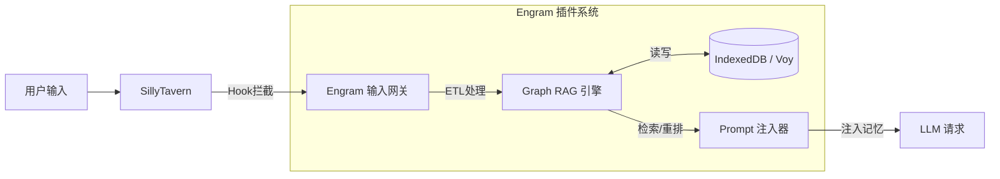
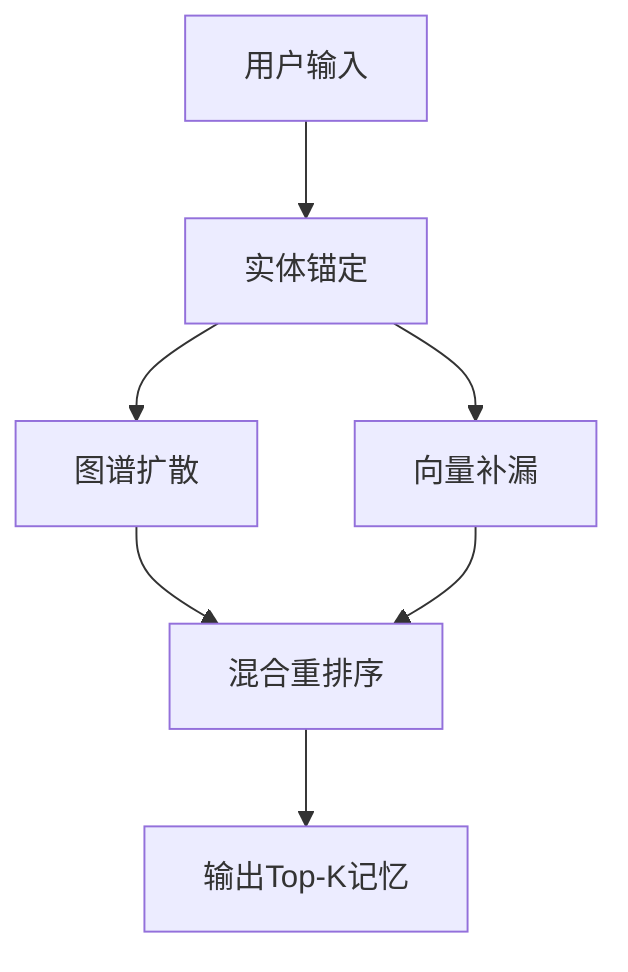

# Engram 系统架构白皮书 v1.0

> **核心愿景**: 为 SillyTavern 打造一个本地优先、基于 Graph RAG 的下一代记忆操作系统。
>
> **Slogan**: *Where memories leave their trace.* (记忆留痕之处)

---

## 1. 宏观架构 (System Overview)

Engram 作为一个 React 应用挂载于 SillyTavern 之上，通过 Adapter 模式与宿主环境交互。系统核心由 **ETL 流水线**、**图谱存储引擎** 和 **混合检索器** 组成。

### 1.1 顶层数据流



---

## 2. 核心技术栈 (Technology Stack)

| 层级 | 技术选型 | 职责 |
|------|----------|------|
| **View** | React 18 + React Flow | 现代化 UI，可视化记忆图谱编辑器 |
| **Styling** | Tailwind CSS | 原子化 CSS，使用 `eg-` 前缀避免与 ST 冲突 |
| **Icons** | Lucide React | 轻量级 SVG 图标库，按需导入，支持 Tree-shaking |
| **Logic** | TypeScript + RxJS | 强类型业务逻辑，处理复杂的异步事件流 |
| **Store** | Zustand + Immer | UI 状态管理，不可变数据操作 |
| **Data** | Dexie.js (IndexedDB) | 存储结构化数据、图谱节点、边关系 |
| **Vector** | Voy (WASM) | 浏览器原生向量搜索，零延迟 |
| **AI** | Transformers.js | 本地跑 Embedding/NER 模型 (可选) |
| **Build** | Vite (Library Mode) | 打包为单文件 JS 注入脚本 |

---

## 3. 核心机制 I: 总结驱动的 Graph RAG (The Engine)

> 这是 Engram 与传统 RAG 插件最大的不同。**我们不存储碎片，我们存储结构化的事件图谱。**

### 3.1 记忆摄入流水线 (Ingestion Pipeline)

当对话积累到一定量（Buffer Full）或手动触发时：

1. **Summarizer (总结器)**
   - 调用 LLM 将对话蒸馏为 JSON Event Block
   - 提取实体：`Subjects` (人物), `Locations` (地点), `Objects` (物品)

2. **Graph Construction (图构建)**
   - 创建/更新节点: 如果"生锈的钥匙"第一次出现，创建一个 `EntityNode`
   - 创建记忆节点: 将总结内容创建为 `EventNode`
   - 建立边 (Link): `EventNode <--> HAS_ENTITY <--> EntityNode`

3. **Vectorization (向量化)**
   - 仅对 `EventNode.summary` 进行 Embedding，存入 Voy

### 3.2 图谱数据结构 (Schema)

在 Dexie 中，我们维护两张核心表来模拟图数据库：

```typescript
// 1. 实体表 (图的"桩")
interface EntityNode {
  id: string;          // e.g., "ent_key_01"
  name: string;        // "生锈的钥匙"
  type: 'CHAR' | 'LOC' | 'ITEM';
  brainId: string;     // 分脑隔离 ID (User + Char)
}

// 2. 记忆事件表 (图的"肉")
interface EventNode {
  id: string;          // e.g., "mem_evt_99"
  summary: string;     // "典狱长在玄关给了我一把钥匙"
  vector: Float32Array;// 语义向量
  
  // 边关系 (Edges) - 通过 ID 软链接
  relatedEntities: string[]; // ["ent_key_01", "ent_warden_02", "ent_hall_03"]
  
  significance: number; // 0.0 - 1.0 (重要性)
  timestamp: number;    // 现实时间戳
  gameTime?: string;    // 游戏内时间
}
```

---

## 4. 核心机制 II: 混合图谱检索 (Retrieval Strategy)

检索不再是单一的"向量相似度"，而是一个 **Walk (游走) + Search (搜索)** 的过程。

### 4.1 检索流程

当用户输入: `"我要去玄关找那把钥匙"`



1. **实体锚定 (Entity Anchoring)**
   - 使用逆向关键词比对，发现输入中包含实体：`[玄关, 钥匙]`
   - 在图谱中锁定这两个 `EntityNode`

2. **图谱扩散 (Graph Expansion)**
   - 找出所有连接到 `[玄关]` 或 `[钥匙]` 的 `EventNode`
   - 这些记忆通过图关系被召回（即使语义不完全匹配）

3. **向量补漏 (Vector Fallback)**
   - 并行运行 Voy 向量搜索，召回语义接近但未命中关键词的记忆

4. **混合重排序 (Hybrid Reranking)**
   ```
   Score = (GraphHit * 0.5) + (VectorSim * 0.4) + (Significance * 0.1)
   ```
   - 如果一个记忆既被图谱命中，又被向量命中，它的分会极高

---

## 5. 核心机制 III: 多维分脑 (Brain Isolation)

为了适配酒馆的"多世界/多卡片"特性，存储层设计了严格的隔离。

### 5.1 Context ID 生成

```typescript
BrainID = Hash(Character_Card_Name + User_ID)
TimelineID = Hash(Chat_File_Name)
```

### 5.2 存储策略

| 层级 | 名称 | 存储内容 | 生命周期 |
|------|------|----------|----------|
| **L1** | Character Brain | 角色的永久设定、长期关系图谱 | 跟随角色 |
| **L2** | Timeline Brain | 当前聊天记录的流水账图谱 | 跟随存档 |

### 5.3 运行时

- `BrainManager` 监听 ST 的 `CHAT_CHANGED` 事件
- 动态切换 `Dexie.liveQuery` 的查询范围

---

## 6. 前端可视化 (The Visualizer)

利用 React Flow 将后台的图谱数据可视化。

### 6.1 World Graph View (世界图谱)

- 展示所有 `EntityNode` (圆圈) 和它们之间的共现频率连线
- 用户可以拖拽节点，手动建立连接
  - 例如：手动将"钥匙"连线到"地下室"，强制 AI 记住关联

### 6.2 Memory Stream View (记忆流)

- 以时间轴形式展示 `EventNode`
- 高亮显示 `Significance > 0.8` 的关键节点

---

## 7. 性能与隐私 (Performance & Privacy)

| 特性 | 说明 |
|------|------|
| **Zero Server Dependency** | 所有向量计算、图谱构建都在用户的浏览器 (WASM/JS) 中完成 |
| **Asynchronous Processing** | 所有 ETL 操作放入 Web Worker，确保 UI 线程永不卡顿 |
| **Incremental GC** | 当存储满时，根据 `Significance` 分数自动剪枝低分记忆 |
