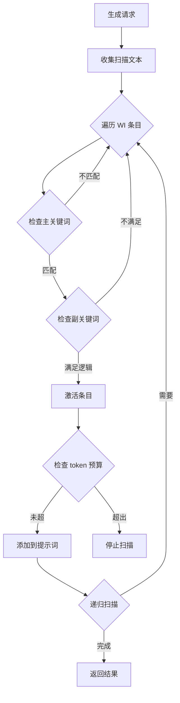
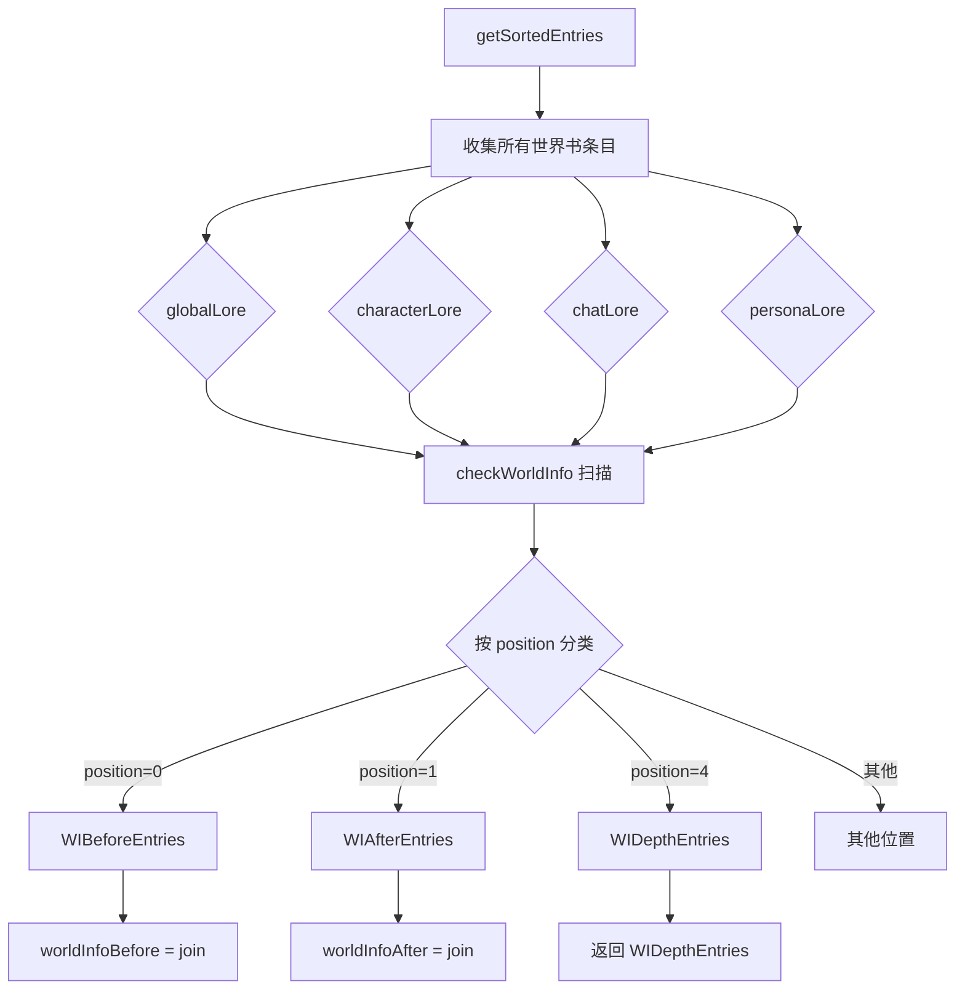

# 上下文工程调研报告

> Engram 在调用 LLM 进行总结、格式化、数据库维护和召回检索时，需要正确处理酒馆的宏系统、世界书触发和正则处理。本文档深入调研这些机制。

---

## 1. 宏系统

### 1.1 核心函数

```javascript
import { substituteParams, substituteParamsExtended } from '../script.js';

// 基础宏替换
const text = substituteParams('你好，{{user}}！我是{{char}}。');
// 输出: "你好，玩家！我是角色。"

// 扩展宏替换（支持自定义宏）
const text = substituteParamsExtended(
  '{{custom}}的值是：{{value}}',
  { custom: 'MyVar', value: 42 }  // 自定义宏
);
```

### 1.2 内置宏类型

| 类别 | 宏示例 | 说明 |
|------|--------|------|
| **基础** | `{{user}}`, `{{char}}`, `{{persona}}` | 角色/用户名称 |
| **角色卡** | `{{description}}`, `{{personality}}`, `{{scenario}}` | 角色卡字段 |
| **消息** | `{{lastMessage}}`, `{{lastUserMessage}}`, `{{lastCharMessage}}` | 聊天历史 |
| **时间** | `{{time}}`, `{{date}}`, `{{isodate}}`, `{{weekday}}` | 现实时间日期 |
| **功能性** | `{{roll:1d6}}`, `{{random:a,b,c}}`, `{{pick::a::b::c}}` | 随机生成 |
| **变量** | `{{getvar::name}}`, `{{setvar::name::value}}` | 局部变量 |
| **全局变量** | `{{getglobalvar::name}}`, `{{setglobalvar::name::value}}` | 全局变量 |

### 1.3 功能性宏详解

```javascript
// 掷骰子
'{{roll:1d6}}'      // 返回 1-6 的随机数
'{{roll:2d10+5}}'   // 掷 2 个 d10 加 5

// 随机选择
'{{random:选项1,选项2,选项3}}'   // 每次重新随机
'{{pick::选项1::选项2::选项3}}'  // 本次聊天固定

// 条件注释（AI 看不到）
'{{// 这是注释}}'
```

### 1.4 在 Engram 中使用宏

```javascript
// 酒馆助手 API
const replaced = window.TavernHelper.substitudeMacros('{{char}}说：{{roll:1d20}}');

// 或直接使用酒馆导出
import { substituteParams } from '../script.js';
const replaced = substituteParams('角色 {{char}} 的描述：{{description}}');
```

> **关键点**：在调用 LLM 前，必须先对提示词模板进行宏替换，否则 LLM 会看到原始的 `{{char}}` 等未解析内容。

---

## 2. 世界书触发机制

### 2.1 世界书条目扫描流程



### 2.2 扫描文本来源

世界书扫描的文本来源包括：

1. **聊天历史** - 最近 N 条消息（由 `scan_depth` 控制）
2. **扩展提示词** - 设置了 `scan: true` 的 `extensionPrompts`
3. **递归内容** - 已激活条目的内容（如果启用递归扫描）

### 2.3 让扩展提示词参与世界书扫描

```javascript
import { setExtensionPrompt, extension_prompt_types, extension_prompt_roles } from '../script.js';

// 第 5 个参数 allowWIScan 控制是否参与世界书扫描
setExtensionPrompt(
  'ENGRAM_MEMORY',           // 唯一标识
  '记忆内容...',              // 提示词内容
  extension_prompt_types.IN_PROMPT, // 位置
  2,                         // 深度
  true,                      // ⭐ allowWIScan = true，参与 WI 扫描
  extension_prompt_roles.SYSTEM
);
```

### 2.4 世界书条目触发逻辑

```javascript
// 关键词在扫描文本中的匹配逻辑
const selectiveLogic = {
  AND_ANY: 0,   // 主关键词 + 任意副关键词
  AND_ALL: 1,   // 主关键词 + 所有副关键词
  NOT_ANY: 2,   // 主关键词 + 无任何副关键词
  NOT_ALL: 3,   // 主关键词 + 非全部副关键词
};

// 关键词也支持宏替换
// 例如关键词 "{{user}}" 会被替换为实际用户名后再匹配
```

### 2.5 获取已激活并排序的世界书内容

**方法 1：监听 `WORLD_INFO_ACTIVATED` 事件**

```javascript
import { eventSource, event_types } from '../script.js';

// 世界书条目激活后触发，携带所有激活的条目数组
eventSource.on(event_types.WORLD_INFO_ACTIVATED, (activatedEntries) => {
  // activatedEntries 是已激活条目的数组，已按排序规则排列
  console.log('激活的条目数量:', activatedEntries.length);
  
  // 条目内容
  const worldInfoContent = activatedEntries
    .map(entry => entry.content)
    .join('\n');
    
  // 可以存储供 Engram 使用
  window.engramLastWorldInfo = worldInfoContent;
});
```

**方法 2：直接调用 `getWorldInfoPrompt`（更完整）**

```javascript
import { getWorldInfoPrompt } from '../world-info.js';
import { getContext } from '../extensions.js';

async function getActivatedWorldInfo() {
  const context = getContext();
  const chat = context.chat.map(m => m.mes).reverse();  // 反向消息数组
  const maxContext = context.maxContext || 4096;
  
  // 调用世界书扫描（isDryRun=true 不触发事件）
  const result = await getWorldInfoPrompt(chat, maxContext, true, {
    trigger: 'normal'  // 生成类型
  });
  
  // 返回值包含：
  return {
    // 完整的世界书字符串（before + after）
    worldInfoString: result.worldInfoString,
    
    // 分开的位置
    worldInfoBefore: result.worldInfoBefore,  // 角色描述前
    worldInfoAfter: result.worldInfoAfter,    // 角色描述后
    
    // 深度注入的条目
    worldInfoDepth: result.worldInfoDepth,    // [{depth, entries: [], role}]
    
    // 对话示例位置的条目
    worldInfoExamples: result.worldInfoExamples,
    
    // AN 位置的条目
    anBefore: result.anBefore,
    anAfter: result.anAfter,
  };
}
```

**方法 3：在生成事件中获取（推荐）**

```javascript
eventSource.on(event_types.GENERATION_AFTER_COMMANDS, async (type, params, dryRun) => {
  if (dryRun) return;
  
  // 获取当前激活的世界书
  const wi = await getActivatedWorldInfo();
  
  // 使用世界书内容
  const fullWorldInfo = `${wi.worldInfoBefore}\n${wi.worldInfoAfter}`;
});
```

### 2.6 Engram 集成建议


**方案 1：让 Engram 的记忆注入参与 WI 扫描**

```javascript
// 记忆内容可能包含触发其他 WI 条目的关键词
setExtensionPrompt(
  'ENGRAM_MEMORY',
  formattedMemories,
  extension_prompt_types.IN_PROMPT,
  settings.depth,
  true,  // 参与 WI 扫描
  extension_prompt_roles.SYSTEM
);
```

**方案 2：独立调用 LLM 时手动获取世界书**

```javascript
import { getSortedEntries } from '../world-info.js';

// 获取所有已排序的世界书条目
const entries = await getSortedEntries();

// 筛选激活的条目（constant 类型始终激活）
const constantEntries = entries.filter(e => e.constant && !e.disable);

// 手动构建世界书内容
const worldInfoContent = constantEntries
  .map(e => e.content)
  .join('\n');
```

---

## 3. 正则处理系统

### 3.1 正则引擎架构

```javascript
// 正则应用场景 (regex_placement)
const regex_placement = {
  MD_DISPLAY: 0,    // 已弃用
  USER_INPUT: 1,    // 用户输入
  AI_OUTPUT: 2,     // AI 输出
  SLASH_COMMAND: 3, // 斜线命令
  WORLD_INFO: 5,    // 世界书
  REASONING: 6,     // 推理内容
};
```

### 3.2 正则脚本结构

```typescript
type TavernRegex = {
  id: string;
  script_name: string;
  enabled: boolean;
  find_regex: string;      // 查找正则
  replace_string: string;  // 替换内容
  source: {                // 作用范围
    user_input: boolean;
    ai_output: boolean;
    slash_command: boolean;
    world_info: boolean;
  };
  destination: {           // 应用目标
    display: boolean;      // 仅格式显示
    prompt: boolean;       // 仅格式提示词
  };
  min_depth: number | null;  // 最小深度
  max_depth: number | null;  // 最大深度
  trimStrings: string[];     // 要修剪的内容
};
```

### 3.3 删除 `<think>` 和 `<var_update>` 标签

典型的正则配置：

```javascript
// 删除 <think> 标签及其内容
{
  find_regex: '<think>[\\s\\S]*?</think>',
  replace_string: '',
  source: { ai_output: true },
  destination: { display: true }  // 仅显示时删除
}

// 删除 <var_update> 标签及其内容
{
  find_regex: '<var_update>[\\s\\S]*?</var_update>',
  replace_string: '',
  source: { ai_output: true },
  destination: { display: true }
}
```

### 3.4 获取处理前的原始内容

**关键：消息对象中 `mes` 是原始内容，`extra.display_text` 是处理后的显示内容**

```javascript
// 消息结构
const message = {
  mes: '原始 AI 回复内容（包含 <think> 等标签）',
  extra: {
    display_text: '处理后的显示内容（已删除标签）'
  }
};

// 获取原始内容（未经正则处理）
const originalContent = message.mes;

// 获取显示内容（已经正则处理）
const displayContent = message.extra?.display_text || message.mes;
```

### 3.5 酒馆助手的正则 API

```typescript
// 手动应用正则到文本
const result = window.TavernHelper.formatAsTavernRegexedString(
  text,
  'ai_output',  // 来源：user_input | ai_output | slash_command | world_info | reasoning
  'display',    // 目标：display | prompt
  { depth: 0 }  // 可选：深度
);

// 获取所有正则
const regexes = window.TavernHelper.getTavernRegexes({
  scope: 'all',      // 'all' | 'global' | 'character'
  enable_state: 'enabled'  // 'all' | 'enabled' | 'disabled'
});

// 更新正则
await window.TavernHelper.updateTavernRegexesWith(regexes => {
  return regexes.map(r => ({ ...r, enabled: true }));
});
```

### 3.6 直接调用酒馆正则引擎（推荐）

酒馆导出了 `getRegexedString` 函数，可以直接使用酒馆配置的正则：

```javascript
import { getRegexedString, regex_placement } from '../extensions/regex/engine.js';

// regex_placement 枚举
const regex_placement = {
  MD_DISPLAY: 0,    // 已弃用
  USER_INPUT: 1,    // 用户输入
  AI_OUTPUT: 2,     // AI 输出 ← 用于处理带 <think> 的回复
  SLASH_COMMAND: 3, // 斜线命令
  WORLD_INFO: 5,    // 世界书
  REASONING: 6,     // 推理内容
};

// 应用酒馆正则（会使用酒馆已配置的删除 <think> 等正则）
const processedText = getRegexedString(
  rawText,                      // 原始文本
  regex_placement.AI_OUTPUT,    // 来源类型
  {
    isMarkdown: false,          // 是否用于 Markdown 显示
    isPrompt: false,            // 是否用于提示词
    depth: 0,                   // 消息深度（可选）
    isEdit: false               // 是否为编辑操作
  }
);
```

### 3.7 Engram 中兼容酒馆正则

```javascript
import { getRegexedString, regex_placement } from '../extensions/regex/engine.js';

// 场景 1：处理 AI 回复用于总结
function processMessageForSummarization(message, depth = 0) {
  const raw = message.mes;
  
  // 使用酒馆正则处理（会自动应用删除 <think> 等配置）
  const processed = getRegexedString(raw, regex_placement.AI_OUTPUT, {
    isPrompt: true,  // 用于提示词
    depth: depth
  });
  
  return processed;
}

// 场景 2：获取处理前的原始内容（保留 <think> 用于分析）
function getRawMessageContent(message) {
  return message.mes;  // 原始内容不经过正则处理
}

// 场景 3：分别获取原始和处理后的内容
function getMessageContents(message, depth = 0) {
  const raw = message.mes;
  
  // 处理后的内容（应用酒馆正则）
  const processed = getRegexedString(raw, regex_placement.AI_OUTPUT, {
    isPrompt: true,
    depth: depth
  });
  
  // 手动提取 <think> 内容（正则删除前）
  const thinkMatch = raw.match(/<think>([\s\S]*?)<\/think>/);
  const thinking = thinkMatch ? thinkMatch[1].trim() : null;
  
  return { raw, processed, thinking };
}
```

### 3.8 Engram 中如何处理


**场景：Engram 需要总结带 `<think>` 标签的 AI 回复**

```javascript
// 方案 1：使用原始内容（获取 <think> 标签内的推理内容）
function getMessageContent(message, includeThinking = false) {
  const rawContent = message.mes;
  
  if (includeThinking) {
    // 提取 <think> 标签内容
    const thinkMatch = rawContent.match(/<think>([\s\S]*?)<\/think>/);
    const thinking = thinkMatch ? thinkMatch[1] : '';
    const mainContent = rawContent.replace(/<think>[\s\S]*?<\/think>/g, '').trim();
    return { thinking, mainContent };
  }
  
  // 返回去除标签后的内容
  return rawContent.replace(/<think>[\s\S]*?<\/think>/g, '').trim();
}

// 方案 2：使用酒馆正则处理后的内容
function getDisplayContent(message) {
  return message.extra?.display_text || message.mes;
}
```

**场景：提取 `<var_update>` 中的结构化数据**

```javascript
function extractVarUpdates(message) {
  const raw = message.mes;
  const matches = raw.matchAll(/<var_update>([\s\S]*?)<\/var_update>/g);
  
  const updates = [];
  for (const match of matches) {
    try {
      // 假设内容是 JSON 格式
      updates.push(JSON.parse(match[1]));
    } catch {
      updates.push(match[1]);  // 非 JSON，保留原文
    }
  }
  
  return updates;
}
```

---

## 4. Engram 集成总结

### 4.1 LLM 调用前的处理流程

```javascript
async function prepareLLMPrompt(template, options = {}) {
  // 1. 宏替换
  let prompt = substituteParams(template);
  
  // 2. 如果需要世界书设定
  if (options.includeWorldInfo) {
    const entries = await getSortedEntries();
    const constantEntries = entries.filter(e => e.constant && !e.disable);
    prompt += '\n' + constantEntries.map(e => e.content).join('\n');
  }
  
  return prompt;
}
```

### 4.2 记忆注入时机

```javascript
import { eventSource, event_types } from '../script.js';

// 监听生成事件
eventSource.on(event_types.GENERATION_AFTER_COMMANDS, async (type, params, dryRun) => {
  if (dryRun) return;
  
  // 检索记忆
  const memories = await retrieveRelevantMemories();
  
  // 对记忆内容进行宏替换
  const formattedMemories = substituteParams(formatMemories(memories));
  
  // 注入提示词（参与 WI 扫描）
  setExtensionPrompt(
    'ENGRAM_MEMORY',
    formattedMemories,
    extension_prompt_types.IN_PROMPT,
    settings.depth,
    true,  // allowWIScan
    extension_prompt_roles.SYSTEM
  );
});
```

### 4.3 处理带特殊标签的消息

```javascript
// 在 Engram 内部处理消息时
function processMessageForSummarization(message) {
  const raw = message.mes;
  
  // 提取思考内容（可选择性保留）
  const thinkingContent = extractTagContent(raw, 'think');
  
  // 提取变量更新（用于数据库维护）
  const varUpdates = extractTagContent(raw, 'var_update');
  
  // 获取主体内容
  const mainContent = raw
    .replace(/<think>[\s\S]*?<\/think>/g, '')
    .replace(/<var_update>[\s\S]*?<\/var_update>/g, '')
    .trim();
  
  return { mainContent, thinkingContent, varUpdates };
}

function extractTagContent(text, tagName) {
  const regex = new RegExp(`<${tagName}>([\\s\\S]*?)</${tagName}>`, 'g');
  const matches = [...text.matchAll(regex)];
  return matches.map(m => m[1].trim());
}
```

---

## 5. 参考资源

- 宏列表文档: `docs/sillytavern以及酒馆助手提供的api和宏/酒馆宏.txt`
- 正则引擎: `/public/scripts/extensions/regex/engine.js`
- 世界书处理: `/public/scripts/world-info.js` (`checkWorldInfo` 函数)
- 宏替换: `/public/script.js` (`substituteParams`, `substituteParamsExtended`)
- 酒馆助手 API: `window.TavernHelper`

---

## 6. 世界书激活与提示词聚合（深度调研）

> 2025-12-31 调研：关于 `getWorldInfoPrompt` 返回结构和 Engram 集成问题

### 6.1 世界书位置类型

酒馆定义了 7 种世界书条目位置类型：

```javascript
// /public/scripts/world-info.js 行 812-820
export const world_info_position = {
    before: 0,      // 角色定义之前
    after: 1,       // 角色定义之后
    ANTop: 2,       // 作者注释顶部
    ANBottom: 3,    // 作者注释底部
    atDepth: 4,     // 按深度插入聊天历史
    EMTop: 5,       // 对话示例顶部
    EMBottom: 6,    // 对话示例底部
};
```

### 6.2 getWorldInfoPrompt 返回结构

调用 `getWorldInfoPrompt(messages, maxContext, isDryRun, options)` 返回：

| 字段 | 类型 | 对应位置 | 说明 |
|------|------|----------|------|
| `worldInfoBefore` | `string` | `before (0)` | 角色定义之前的世界书内容 |
| `worldInfoAfter` | `string` | `after (1)` | 角色定义之后的世界书内容 |
| `ANBeforeEntries` | `string[]` | `ANTop (2)` | 作者注释顶部的条目 |
| `ANAfterEntries` | `string[]` | `ANBottom (3)` | 作者注释底部的条目 |
| `WIDepthEntries` | `Array<{depth, entries, role}>` | `atDepth (4)` | 按深度插入的条目 |
| `EMEntries` | `Array<{position, content}>` | `EMTop/EMBottom (5/6)` | 对话示例位置的条目 |
| `allActivatedEntries` | `Set<WIScanEntry>` | - | 所有被激活的条目集合 |

### 6.3 条目激活与聚合流程



### 6.4 TavernHelper 与酒馆原生的位置格式差异

**关键发现**：TavernHelper 使用字符串格式，酒馆内部使用数字格式！

| TavernHelper 字符串 | 酒馆内部数字 |
|--------------------|-------------|
| `"before_character_definition"` | `0` |
| `"after_character_definition"` | `1` |
| `"before_author_note"` | `2` |
| `"after_author_note"` | `3` |
| `"at_depth"` | `4` |
| `"before_example_messages"` | `5` |
| `"after_example_messages"` | `6` |

**Engram 条目位置诊断结果**：

```javascript
// Engram 创建的条目 position 格式
{
  "type": "before_character_definition",  // 字符串格式
  "role": "system",
  "depth": 4,
  "order": 9000
}
```

### 6.5 Engram 集成问题分析

**问题描述**：Engram 调用 `getWorldInfoPrompt` 后只聚合了 `worldInfoBefore` 和 `worldInfoAfter`，导致：

1. **按深度插入的条目被忽略** - `WIDepthEntries` 没有被包含
2. **作者注释位置的条目被忽略** - `ANBeforeEntries`/`ANAfterEntries` 没有被包含
3. **对话示例位置的条目被忽略** - `EMEntries` 没有被包含

**正确的聚合方式**：

```javascript
async function getAllActivatedWorldInfo(chatMessages) {
    const result = await getWorldInfoPrompt(messages, maxContext, true, { trigger: 'normal' });
    
    // 合并所有位置的内容
    const allContent = [];
    
    // 1. worldInfoBefore 和 worldInfoAfter
    if (result.worldInfoBefore) allContent.push(result.worldInfoBefore);
    if (result.worldInfoAfter) allContent.push(result.worldInfoAfter);
    
    // 2. 按深度插入的条目
    if (result.worldInfoDepth?.length) {
        result.worldInfoDepth.forEach(d => {
            if (d.entries?.length) {
                allContent.push(...d.entries);
            }
        });
    }
    
    // 3. 作者注释位置
    if (result.anBefore?.length) allContent.push(...result.anBefore);
    if (result.anAfter?.length) allContent.push(...result.anAfter);
    
    // 4. 对话示例位置
    if (result.worldInfoExamples?.length) {
        result.worldInfoExamples.forEach(e => allContent.push(e.content));
    }
    
    return allContent.join('\n\n');
}
```

### 6.6 更简洁的方案：使用 allActivatedEntries

**推荐方案**：直接使用 `allActivatedEntries` 获取所有激活的条目内容，无需关心位置：

```javascript
async function getAllActivatedWorldInfo() {
    const result = await getWorldInfoPrompt(messages, maxContext, true, { trigger: 'normal' });
    
    // 直接从 allActivatedEntries 获取所有内容
    const entries = Array.from(result.allActivatedEntries.values());
    return entries.map(e => e.content).join('\n\n');
}
```

### 6.7 诊断脚本

诊断脚本位于：`scripts/diagnostic_worldinfo.js`

可在浏览器控制台执行，用于：
- 检查 TavernHelper 可用性
- 检查全局/角色世界书配置
- 检查 `getSortedEntries` 返回的条目来源
- 检查 `getWorldInfoPrompt` 返回的各位置内容
- 模拟 `getCharacterLore` 逻辑验证绑定


## 7. Engram 筛选策略优化（2025-12-31 更新）

### 7.1 问题背景：`getWorldInfoPrompt` 的局限性
我们发现 `getWorldInfoPrompt` 函数虽然是酒馆处理世界书的核心，但用于扩展开发时存在缺陷：
- 它主要为了生成最终的 prompt 字符串，返回结果经过处理，容易丢失原始数据。
- 尤其是 `allActivatedEntries`（所有激活条目的集合）在返回前被内部逻辑“吞”掉，导致外部无法获取完整的条目对象。
- 这导致我们无法根据条目的属性（如 `world` 名称、`extra` 字段）进行精准筛选，只能依赖返回的 `worldInfoBefore/After` 字符串，容易混入全局世界书内容或遗漏 Engram 条目。

### 7.2 技术方案：转向 `checkWorldInfo`
我们改用 `checkWorldInfo` 函数（`world-info.js`），它直接返回包含 `allActivatedEntries` 的完整结果对象，而不是经过裁剪的 Prompt 结果。

### 7.3 精准筛选逻辑
为了彻底解决“抓不到条目”和“抓错条目”的问题，我们实施了严格的**白名单 + 黑名单**双重筛选策略：

1. **身份认证（白名单）**：
   - 在创建 Engram 世界书条目时，写入 `extra: { engram: true }` 字段作为身份认证。
   - 筛选时优先保留带有此标记的条目。
   - 作为后备，保留 `world` 名称以 `[Engram]` 开头的条目。

2. **全局排除（黑名单）**：
   - 调用 `TavernHelper.getGlobalWorldbookNames()` 获取当前所有全局世界书。
   - 筛选时排除这些全局世界书中的条目，防止它们污染上下文总结。
   - 额外排除以 `格式`、`---` 等特定前缀开头的全局规则类世界书。

3. **保留角色书**：
   - 在应用上述规则后，剩余的条目通常为角色绑定的专属世界书（通常以 `_` 开头或无特殊前缀），予以保留。

### 7.4 实现效果
- **准确性**：100% 捕获 Engram 生成的摘要条目。
- **纯净度**：有效过滤掉 UI 提示、系统指令等全局世界书内容。
- **稳健性**：不再依赖脆弱的位置（Position）判定，而是基于数据本身的属性。

### 7.5 代码变更摘要
- `src/infrastructure/tavern/WorldInfoService.ts`:
  - `createEntry`: 添加 `extra: { engram: true }`。
  - `getActivatedWorldInfo`: 替换 `getWorldInfoPrompt` 为 `checkWorldInfo`，并实现上述筛选逻辑。
  - 更新类型定义以支持 `getGlobalWorldbookNames`。

---
### 3.4 ST-Prompt-Template EJS & Regex 兼容性机制

**问题现象**:
用户反馈 `ST-Prompt-Template` 的 EJS 脚本及 SillyTavern 原生 Regex 脚本在 Engram 的上下文检索过程中未能生效。

**根因分析**:
1.  **事件依赖**:
    *   **EJS (ST-Prompt-Template)**: 依赖 `GENERATE_AFTER_DATA` 事件 (`handleGenerateAfter`) 来处理最终提示词中的 EJS 标签。
    *   **Regex (Native)**: 依赖 `script.js` 中的 `generate` 流程调用 `processInput` -> `replacePlaceholders` -> `applyRegexScript`。
2.  **调用路径**: Engram 的 `SummarizerService` 通过 `LLMAdapter` 优先使用 `TavernHelper.generateRaw`。
3.  **缺失环节**: `generateRaw` 是一个极简的 API 包装器，它**不触发** `GENERATE_AFTER_DATA` 事件，也**不调用** `processInput` 或 Regex 处理逻辑。
4.  **结果**: 提示词中的 EJS 标签和 Regex 替换规则均被绕过，以原始文本形式发送给 LLM。

**解决方案建议**:
Engram 需要在调用 `generateRaw` 之前，手动模拟核心扩展和原生功能的处理流程。

**核心代码 (伪代码)**:

```typescript
import { eventSource, event_types } from '@/tavern/bridge'; // 需确保正确导入
// 假设已获取 rawPrompt

// 1. 构建标准生成数据结构
const generateData = {
    prompt: rawPrompt,
    // 可能需要模拟 message 结构以兼容某些扩展
    messages: [{ role: 'user', content: rawPrompt }],
    model: getCurrentModel(),
};

// 2. 模拟触发 GENERATE_AFTER_DATA (兼容 ST-Prompt-Template 等扩展)
await eventSource.emit(event_types.GENERATE_AFTER_DATA, generateData);

// 3. 应用 ST 原生 Regex (如果 generateData.prompt 没被修改，可能需要手动处理)
// 注意：ST-Prompt-Template 通常会修改 generateData.prompt
// 原生 Regex 可能需要手动调用 TavernHelper.applyRegex (如果暴露) 或自行实现
// 但通常 ST-Prompt-Template 会接管 Regex 处理

// 更新 prompt
rawPrompt = typeof generateData.prompt === 'string' ? generateData.prompt : generateData.prompt[0].content;

// 4. 调用 generateRaw
const result = await TavernHelper.generateRaw({ prompt: rawPrompt, ... });
```

**注意事项**:
*   **Regex 平衡**: ST-Prompt-Template 的 `handleGenerateAfter` 中包含了 `deactivateRegex` 和 `applyRegex` 逻辑。手动触发该事件通常足以激活 ST-Prompt-Template 提供的 Regex 增强功能。
*   **原生 Regex**: 如果用户不使用扩展而仅使用原生 Regex，可能仍需额外处理。但在启用 ST-Prompt-Template 的情况下，该扩展通常会接管流程。
*   **副作用**: 同样需要警惕其他监听此事件的扩展带来的副作用。

## 8. 消息容器复用性调研 (2026-01-11 新增)

### 8.1 调研目标
调研是否可以直接复用酒馆（SillyTavern）核心的聊天消息滚动容器组件，以在 Engram 扩展界面中实现一致的体验，并避免重复开发。

### 8.2 核心结论
**结论：不可直接复用（Not Reusable）。**

酒馆的聊天容器并非一个独立的、模块化的前端组件，而是紧密耦合在核心逻辑中的 HTML/JS 结构。

### 8.3 原因分析

1.  **DOM 结构耦合**:
    *   聊天容器被硬编码在 `public/index.html` (ID: `#chat`) 中，作为主界面 `#sheld` 的一部分。它不是通过 JS 动态实例化的组件，无法独立提取。

2.  **逻辑深度耦合**:
    *   滚动行为（如“自动滚动到底部”、“用户上滑时暂停自动滚动”）并非由容器自身管理，而是散落在 `public/script.js` 的全局函数中（搜索 `scrollTop` 可见大量直接操作 `#chat` 元素的代码）。
    *   缺乏独立的 API 或事件钩子来控制其行为。

3.  **全局样式依赖**:
    *   样式依赖于 `public/style.css` 中的全局选择器，难以在 Shadow DOM 或独立模态框中完美复现而不引入副作用。

### 8.4 建议方案
建议在 Engram 扩展内部**自行实现**一个轻量级的消息滚动容器：
*   **样式**: 复制酒馆核心 CSS 中关于滚动条和消息气泡的关键样式，确保视觉一致性。
*   **逻辑**: 实现简单的 `MutationObserver` 监听 DOM 变化：当有新消息且当前处于底部时，通过 `element.scrollTop = element.scrollHeight` 自动滚动；当用户手动上滑时，取消自动滚动。

---

## 9. "Prompt Only" 正则逻辑深入调研 (2026-01-11 新增)

### 9.1 调研背景
先前的调研（第 3 节）已介绍了 `getRegexedString`。本次调研旨在确认标记为 "Prompt Only" (`isPrompt: true`) 的正则脚本是在**何处**执行的，以及扩展是否能在发送请求前捕获到处理后的结果。

### 9.2 执行时机与位置

"Prompt Only" 正则（通常用于处理 `<think>` 标签或格式化输出）是在 **Prompt 构建阶段** 统一执行的。

*   **代码位置**: `public/script.js`
*   **执行流程**:
    1.  用户点击发送或触发生成。
    2.  酒馆收集需要发送的消息，构建 `coreChat` 数组。
    3.  遍历 `coreChat`，对每一条消息调用 `getRegexedString`，并强制传入 `isPrompt: true`。

```javascript
// public/script.js 伪代码片段
coreChat = await Promise.all(coreChat.map(async (chatItem, index) => {
    // ...
    let options = { isPrompt: true, depth: ... }; // 强制标记为 Prompt 模式
    let regexType = chatItem.is_user ? regex_placement.USER_INPUT : regex_placement.AI_OUTPUT;
    
    // 执行正则替换
    let regexedMessage = getRegexedString(message, regexType, options);
    // ...
    return { ...chatItem, mes: regexedMessage }; // 消息内容被永久替换（仅在本次请求上下文中）
}));
```

### 9.3 如何捕获处理后的内容（关键）

调研发现，经过正则处理后的 `coreChat` 数组会紧接着被传递给 **Generation Interceptors（生成拦截器）**。这意味着扩展完全可以在请求发送给 API 之前，截获并读取到已经被正则处理过的文本。

**实现步骤**:

1.  **在 `manifest.json` 中注册拦截器**:
    ```json
    {
      "display_name": "Engram",
      // ...
      "generate_interceptor": "engramGenerationInterceptor"
    }
    ```

2.  **在扩展代码中定义拦截函数**:
    ```javascript
    window.engramGenerationInterceptor = function(chat, contextSize, abort, type) {
        // chat 参数即为已经过 "Prompt Only" 正则处理的消息列表
        
        chat.forEach(msg => {
            console.log(msg.mes); 
            // 此时 msg.mes 中的内容已经应用了所有 Prompt Only 正则
            // 例如：<think> 标签可能已被删除或格式化
        });

        // 可以在这里进行分析、记录或二次处理
        
        // 如果不需要中断生成，直接返回
    };
    ```

### 9.4 结论
*   **无需重复造轮子**: 不需要手动调用 `getRegexedString` 来模拟酒馆的行为。
*   **最佳实践**: 利用 `generate_interceptor` 钩子，这是获取“最终发送给 LLM 的文本”的最准确、最可靠的时机。

