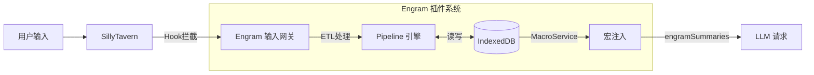

# Engram 系统架构白皮书 V0.9.4

> **核心愿景**: 为 SillyTavern 打造一个本地优先、基于 Graph RAG 的下一代记忆操作系统。
>
> **Slogan**: *Where memories leave their trace.* (记忆留痕之处)
> **Version**: v0.9.4
> **Last Modified**: 2026-01-16

---

## 1. 宏观架构 (System Overview)

Engram 作为一个 React 应用挂载于 SillyTavern 之上，通过 Adapter 模式与宿主环境交互。系统核心由 **ETL 流水线**、**IndexedDB 存储** 和 **宏注入系统** 组成。

### 1.1 顶层数据流



---

## 2. 核心技术栈 (Technology Stack)

| 层级 | 技术选型 | 职责 |
|------|----------|------|
| **View** | React 18 + Lucide | 现代化 UI，图标组件库 |
| **Styling** | TailwindCSS + Design Tokens | 组件样式 + 统一设计变量 |
| **Logic** | TypeScript | 强类型业务逻辑 |
| **Store** | Zustand (memoryStore) | UI 状态 + IndexedDB 操作封装 |
| **Data** | Dexie.js (IndexedDB) | 持久化存储：Scope, EventNode, EntityNode |
| **Build** | Vite (Library Mode) | 打包为单文件 JS 注入脚本 |

---

## 3. 核心机制 I: 数据存储 (V0.5 架构)

### 3.1 IndexedDB 优先

| Before (V0.4) | After (V0.5) |
|---------------|--------------|
| WorldBook 存储摘要条目 | IndexedDB 存储 EventNode |
| WorldBookStateService 管理状态 | memoryStore (Zustand) 管理状态 |
| 每次总结写 WB 条目 | 每次总结写 IndexedDB |

### 3.2 数据结构

**V0.6+ 多数据库架构**: 每个 `chat_id` 拥有独立的 IndexedDB 数据库 (`Engram_{chatId}`)，因此不再需要 `scope_id` 分区字段。

```typescript
// EventNode - 事件节点（核心记忆单元）
interface EventNode {
    id: string;               // UUID
    
    summary: string;          // For Model (高密度文本，用于 Embedding 和 RAG)
    structured_kv: {          // For Machine (结构化，用于图谱和过滤)
        time_anchor: string;
        role: string[];
        location: string;
        event: string;
        logic: string[];
        causality: string;
    };
    
    embedding?: number[];     // 语义向量 (可选)
    is_embedded: boolean;     // 是否已向量化
    is_archived: boolean;     // 是否已归档 (🟢绿灯: 条件触发)
    
    significance_score: number;
    level: number;            // 0=原始, 1+=精简层级
    source_range: { start_index: number; end_index: number };
    timestamp: number;
    parent_id?: string;       // 父节点 (精简来源)
}

// EntityNode - 实体节点（V0.9.4 无边设计 + 双重结构）
interface EntityNode {
    id: string;
    name: string;
    type: EntityType;         // 'char' | 'loc' | 'item' | 'concept' | 'unknown'
    aliases: string[];        // 别名列表 (MultiEntry索引)
    description: string;      // [For Model] YAML 烧录文本
    profile: Record<string, unknown>;  // [For Machine] 开放式 KV 容器
    last_updated_at: number;
    layout_x?: number;        // 图谱布局坐标
    layout_y?: number;
}

// EntityRelation - 实体关系 (V0.9.4)
// 存放在 EntityNode.profile.relations 数组中
interface EntityRelation {
    target: string;           // 目标实体名
    type: string;             // 关系类型 (friend/enemy/master等)
    description?: string;     // 关系细节
}

// ScopeState - 聊天状态（存储在 meta 表中）
interface ScopeState {
    last_summarized_floor: number;
    token_usage_accumulated: number;
    last_compressed_at: number;
    active_summary_order: number;
    last_extracted_floor: number;  // V0.9.1: 上次实体提取楼层
}
```

---

## 4. 核心机制 II: Pipeline 流水线

### 4.1 写入流程

```
SummarizerService.triggerSummary()
    ↓
Extractor.extract() → LLM → ExtractedEvent[]
    ↓
Pipeline.process() → EventNode
    ↓
memoryStore.saveEvent() → IndexedDB
    ↓
MacroService.refreshCache()
```

### 4.2 精简流程 (EventTrimmer)

```
触发条件: Token 超限 / 事件数量超限
    ↓
EventTrimmer.trim()
    ↓
getEventsToMerge() → 获取待合并事件
    ↓
Extractor.extract() → LLM 压缩
    ↓
saveEvent(level=1) + deleteEvents(原事件)
```

### 4.3 实体提取流程 (V0.9.4)

```
chatHistory → SummarizerService.handleMessageReceived()
    ↓
checkEntityExtraction() → 楼层间隔检查
    ↓
EntityBuilder.extractFromChat(chatHistory, floor)
    ↓
LLM 提取 → 消歧 → profileToYaml() → memoryStore.saveEntity()
    ↓
更新 ScopeState.last_extracted_floor
```

> **V0.9.4 变更**: LLM 输出开放式 `profile` 结构，由 `profileToYaml()` 生成 `description` 烧录文本

> **并行架构**: 实体提取与 Summary 并行触发，各自独立楼层间隔

---

## 5. 核心机制 III: 宏注入系统

### 5.1 WorldBook 槽位

- `WorldBookSlotService` 初始化时创建占位条目
- 条目内容包含 `{{engramSummaries}}` 宏
- 宏在 LLM 请求前被展开

### 5.2 MacroService

```typescript
// 注册宏
getContext().registerMacro('engramSummaries', () => {
    return MacroService.cache;  // 从 IndexedDB 缓存读取
});
```

---

## 6. 关键服务文件

### 6.1 数据层
| 文件 | 职责 |
|------|------|
| `services/database/db.ts` | EngramDB (Dexie) 定义 |
| `services/database/ScopeManager.ts` | Scope 解析与状态管理 |
| `stores/memoryStore.ts` | Zustand Store + IndexedDB 操作封装 |

### 6.2 Pipeline 层
| 文件 | 职责 |
|------|------|
| `services/pipeline/Pipeline.ts` | ETL 编排器 |
| `services/pipeline/Extractor.ts` | LLM 调用 + JSON 解析 |
| `services/pipeline/EventTrimmer.ts` | 事件精简服务 |

### 6.3 注入层
| 文件 | 职责 |
|------|------|
| `tavern/MacroService.ts` | 宏注册与缓存管理 |
| `services/WorldBookSlotService.ts` | WB 槽位初始化 |

### 6.4 UI 层
| 文件 | 职责 |
|------|------|
| `views/Processing/SummaryPanel.tsx` | 总结控制面板 |
| `views/Processing/EntityConfigPanel.tsx` | 实体提取配置 (V0.9.1) |
| `views/MemoryStream/index.tsx` | 记忆流可视化 |
| `views/MemoryStream/GraphView.tsx` | 图谱可视化 (V0.9.1) |
| `views/APIPresets/` | API 和提示词配置 |

---

## 7. 提示词模板系统

### 7.1 分类 (PromptCategory)

| 分类 | 用途 | 文件 |
|------|------|------|
| `summary` | 剧情摘要 (JSON) | `prompts/summary_prompt.md` |
| `trim` | 记忆精简 | `prompts/trim.md` |
| `preprocessing` | 输入预处理 (V0.8) | `prompts/query_enhance.md`, `plot_director.md`, `description.md` |
| `entity_extraction` | 实体提取 (V0.9.4) | `prompts/entity_extraction.md` |

### 7.2 预处理内置模板 (V0.8)

| 模板 | 功能 | 输出标签 |
|------|------|----------|
| Query 增强 | 扩展用户输入的指代词，优化 RAG 检索 | `<query>`, `<output>` |
| 剧情编排 | 生成导演指令框架 | `<output>` |
| 描写增强 | 补充细节描写和环境氛围 | `<output>` |

### 7.3 模板管理
- 通过 `APIPresets` UI 编辑
- 内置模板 + 用户自定义模板
- 每个分类只有一个启用的模板生效

---

## 8. 性能与隐私

| 特性 | 说明 |
|------|------|
| **Zero Server Dependency** | 所有数据存储在用户浏览器 IndexedDB |
| **本地 LLM 支持** | 可配置使用 Ollama 等本地模型 |
| **增量处理** | 仅处理新消息，避免重复计算 |
