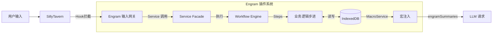

# Engram 系统架构白皮书 V0.9.9

> **核心愿景**: 为 SillyTavern 打造一个本地优先、基于 Graph RAG 的下一代记忆操作系统。
>
> **Slogan**: *Where memories leave their trace.* (记忆留痕之处)
> **Version**: v0.9.9 (Layered Modular Architecture)
> **Last Modified**: 2026-01-18

---

## 1. 宏观架构 (System Overview)

Engram 作为一个 React 应用挂载于 SillyTavern 之上，通过 Adapter 模式与宿主环境交互。系统核心由 **ETL 流水线**、**IndexedDB 存储** 和 **宏注入系统** 组成。

### 1.1 顶层数据流



---

## 2. 核心技术栈 (Technology Stack)

| 层级 | 技术选型 | 职责 |
|------|----------|------|
| **View** | React 18 + Lucide | 现代化 UI，图标组件库 |
| **Styling** | TailwindCSS + Design Tokens | 组件样式 + 统一设计变量 |
| **Logic** | TypeScript | 强类型业务逻辑 |
| **Store** | Zustand (`src/state`) | UI 状态 + IndexedDB 操作封装 |
| **Data** | Dexie.js (IndexedDB) | 持久化存储 (`src/data`) |
| **Modules** | Modular Services | 业务逻辑 (`src/modules`) |
| **Core** | Shared Types/Events | 核心契约 (`src/core`) |
| **Build** | Vite (Library Mode) | 打包为单文件 JS 注入脚本 |

---

## 3. 核心机制 I: 数据存储 (V0.5 架构)

### 3.1 IndexedDB 优先

| Before (V0.4) | After (V0.5+) |
|---------------|--------------|
| WorldBook 存储摘要条目 | IndexedDB 存储 EventNode |
| WorldBookStateService 管理状态 | memoryStore (Zustand) 管理状态 |
| 每次总结写 WB 条目 | 每次总结写 IndexedDB |

### 3.2 数据结构

**V0.6+ 多数据库架构**: 每个 `chat_id` 拥有独立的 IndexedDB 数据库 (`Engram_{chatId}`)，因此不再需要 `scope_id` 分区字段。

```typescript
// 定义: src/core/types/memory.ts
interface EventNode {
    id: string;               // UUID
    summary: string;          // For Model (高密度文本)
    structured_kv: { ... };   // For Machine (结构化)
    // ...
}

interface EntityNode {
    id: string;
    name: string;
    profile: Record<string, unknown>;  // [For Machine] 开放式 KV 容器
    // ...
}
```

---

## 4. 核心机制 II: Workflow 工作流引擎

Engram 废弃了硬编码的 ETL Pipeline，转而使用灵活的图式工作流引擎。

### 4.1 架构层次

```
[Service Facade] (Summarizer, EntityExtractor)
    │ 接收请求，准备上下文
    ▼
[Workflow Engine] (src/modules/workflow/WorkflowEngine.ts)
    │ 加载 Workflow Definition
    │ 拓扑排序 Steps
    ▼
[Workflow Steps]
    │ 1. Context Steps (FetchChatHistory)
    │ 2. LLM Steps (GenerateSummary - Load YAML Prompt)
    │ 3. Processing Steps (Regex Process)
    │ 4. Persistence Steps (SaveEvent)
```

### 4.2 写入流程 (Summary Workflow)

```
SummarizerService.summarize()
    ↓
WorkflowEngine.run(summaryWorkflow)
    ↓
FetchChatHistory → GenerateSummary → CleanRegex → SaveEvent
    ↓
IndexedDB (EventNode)
```

### 4.2 精简流程 (EventTrimmer)

```
触发条件: Token 超限 / 事件数量超限
    ↓
EventTrimmer.trim() (src/modules/memory)
    ↓
getEventsToMerge() → 获取待合并事件
    ↓
Extractor.extract() → LLM 压缩
    ↓
saveEvent(level=1) + deleteEvents(原事件)
```

---

## 5. 核心机制 III: 宏注入系统

### 5.1 WorldBook 槽位

- `WorldBookSlotService` 初始化时创建占位条目
- 条目内容包含 `{{engramSummaries}}` 宏
- 宏在 LLM 请求前被展开

### 5.2 MacroService

```typescript
// 注册宏 in src/integrations/tavern/macros.ts
getContext().registerMacro('engramSummaries', () => {
    return MacroService.cache;  // 从 IndexedDB 缓存读取
});
```

---

## 6. 关键服务文件索引

### 6.1 数据层 (`src/data`)
| 文件 | 职责 |
|------|------|
| `db.ts` | EngramDB (Dexie) 定义 |
| `ChatManager.ts` | 聊天状态管理 |
| `ScopeManager.ts` | Scope 解析与状态管理 |

### 6.2 模块层 (`src/modules`)
| 文件 | 职责 |
|------|------|
| `workflow/WorkflowEngine.ts` | 工作流执行引擎 |
| `workflow/definitions/*.ts` | 工作流定义 |
| `workflow/steps/*.ts` | 具体的业务步骤 |
| `memory/extractors/Extractor.ts` | LLM 调用 + JSON 解析 |
| `memory/EventTrimmer.ts` | 事件精简服务 |
| `rag/retrieval/Retriever.ts` | 统一检索服务 |
| `preprocessing/Preprocessor.ts` | 预处理核心逻辑 |

### 6.3 状态与集成层 (`src/state`, `src/integrations`)
| 文件 | 职责 |
|------|------|
| `state/memoryStore.ts` | Zustand Store + IndexedDB 操作封装 |
| `integrations/tavern/macros.ts` | 宏注册与缓存管理 |
| `integrations/tavern/bridge.ts` | 宿主交互桥接 |

### 6.4 UI 层 (`src/ui`)
| 文件 | 职责 |
|------|------|
| `views/Processing/SummaryPanel.tsx` | 总结控制面板 |
| `views/Processing/EntityConfigPanel.tsx` | 实体提取配置 |
| `views/MemoryStream/index.tsx` | 记忆流可视化 |
| `views/APIPresets/` | API 和提示词配置 |

---

## 7. 提示词模板系统

- **位置**: `src/integrations/llm/SystemPrompts/` (或通过 `APIPresets` 管理)
- **分类**: `summary`, `trim`, `preprocessing`, `entity_extraction`

---

## 8. 性能与隐私

| 特性 | 说明 |
|------|------|
| **Zero Server Dependency** | 所有数据存储在用户浏览器 IndexedDB |
| **本地 LLM 支持** | 可配置使用 Ollama 等本地模型 |
| **增量处理** | 仅处理新消息，避免重复计算 |
