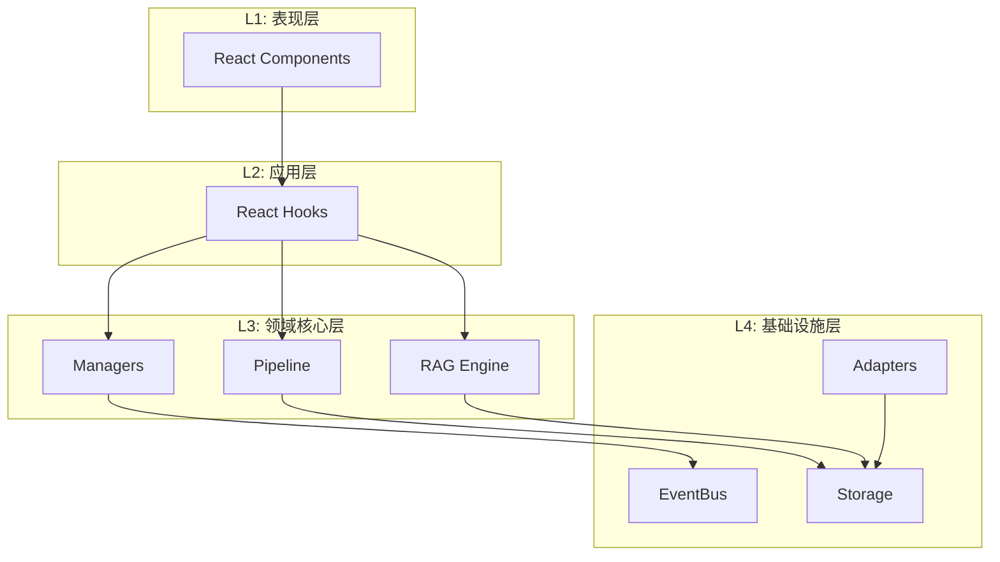

# Engram 工程目录结构指南

> 此目录结构基于 **React + Vite + TypeScript**，采用 **DDD (领域驱动设计)** 分层，将核心逻辑与 UI 彻底解耦。

---

## 📁 目录结构总览

```
/
├── assets/                    # 静态资源
│   └── logo/                  # Logo 文件
│       ├── Engram_icon.svg    # 图标 (悬浮球)
│       ├── Engram_logo.svg    # 完整 logo (面板头部)
│       └── Engram_textlogo.svg# 文字 logo
│
├── src/
│   │
│   │   // ═══ L4: 基础设施层 (Infrastructure) ═══
│   ├── infrastructure/
│   │   ├── bus/               # 事件总线 (RxJS)
│   │   │   └── EventBus.ts    
│   │   ├── storage/           # 数据库适配器
│   │   │   ├── DexieDB.ts     # IndexedDB 实例 (Graph Storage)
│   │   │   └── VectorDB.ts    # Voy 实例 (Vector Storage)
│   │   └── adapter/           # 外部系统适配器
│   │       ├── STBridge.ts    # SillyTavern API 桥接 (jQuery Hooks)
│   │       └── LLMAdapter.ts  # 统一 LLM 调用接口
│   │
│   │   // ═══ L3: 领域核心层 (Domain / Core) ═══
│   ├── core/
│   │   ├── pipeline/          # 数据处理流水线
│   │   │   ├── Pipeline.ts    # 管道控制器
│   │   │   ├── steps/
│   │   │   │   ├── Summarizer.ts  # LLM 总结 & 实体提取
│   │   │   │   ├── GraphBuilder.ts# 构建图谱节点与边
│   │   │   │   └── Vectorizer.ts  # 计算 Embedding
│   │   │
│   │   ├── rag/               # RAG 核心算法
│   │   │   ├── Retriever.ts   # 混合检索器 (Graph + Vector)
│   │   │   └── Reranker.ts    # 重排序逻辑
│   │   │
│   │   ├── manager/           # 状态管理器
│   │   │   ├── BrainManager.ts # 分脑逻辑 (Context Switching)
│   │   │   └── ConfigManager.ts# 配置持久化
│   │   │
│   │   └── types/             # 领域模型定义
│   │       ├── graph.d.ts     # EntityNode, EventNode 定义
│   │       └── events.d.ts    # 系统事件定义
│   │
│   │   // ═══ L2: 应用层 (Application / Hooks) ═══
│   ├── hooks/
│   │   ├── useGraphData.ts    # 订阅图谱数据 (用于 React Flow)
│   │   ├── useMemoryStream.ts # 订阅记忆流 (用于列表展示)
│   │   └── useIngestion.ts    # 控制摄入状态
│   │
│   │   // ═══ L1: 表现层 (Presentation / UI) ═══
│   ├── components/
│   │   ├── core/              # 核心 UI 容器
│   │   │   ├── FloatingOrb.tsx # 悬浮球入口 (Logo 放置处)
│   │   │   └── MainPanel.tsx   # 主面板 Frame
│   │   │
│   │   ├── graph/             # 图谱可视化组件
│   │   │   ├── WorldEditor.tsx # React Flow 画布
│   │   │   ├── CustomNodes.tsx # 自定义节点样式
│   │   │   └── ControlBar.tsx  # 画布控制器
│   │   │
│   │   ├── memory/            # 记忆列表组件
│   │   │   ├── MemoryCard.tsx
│   │   │   └── SearchBar.tsx
│   │   │
│   │   └── settings/          # 设置页面
│   │
│   ├── App.tsx                # 根组件
│   ├── main.tsx               # 入口 (Mount Logic)
│   └── styles/                # CSS (Tailwind + eg- 前缀)
│       └── main.css           # 主样式入口
│
├── dist/                      # 构建输出
│   ├── index.js               # 打包后的 JS
│   └── style.css              # 打包后的 CSS
│
├── manifest.json              # ST 插件清单
├── vite.config.ts             # Vite 配置 (Library Mode)
├── tailwind.config.js         # Tailwind 配置 (eg- 前缀)
├── postcss.config.js          # PostCSS 配置
├── tsconfig.json
└── package.json
```

---

## 🔑 关键模块职责说明

### 1. `src/core/pipeline/steps/GraphBuilder.ts`

> **这是 Engram 的灵魂构建者。**

| 项目 | 说明 |
|------|------|
| **输入** | `StoryEvent` (从 Summarizer 出来的 JSON) |
| **职责** | 1. 检查 `StoryEvent.meta.characters` 里的名字，去 `EntityTable` 查找是否已存在。不存在则创建。<br>2. 创建 `EventNode` 存入 `MemoryTable`。<br>3. 在 `EntityTable` 和 `MemoryTable` 之间建立引用关系（这就是图的边）。 |

---

### 2. `src/core/rag/Retriever.ts`

> **这是 Graph RAG 的消费者。**

| 项目 | 说明 |
|------|------|
| **职责** | 实现 "Entity Anchoring" 算法。先通过正则/关键词匹配找到"桩"(Entity)，然后把该桩连着的所有"肉"(Event) 拔出来。 |

---

### 3. `src/components/graph/WorldEditor.tsx`

> **这是 Engram 的可视化窗口。**

| 项目 | 说明 |
|------|------|
| **职责** | 读取 DexieDB 中的 `EntityNodes` 和它们之间的关联频率，渲染成 React Flow 图表。 |

---

### 4. `src/infrastructure/adapter/STBridge.ts`

> **这是唯一的"脏代码"聚集地。**

| 项目 | 说明 |
|------|------|
| **职责** | 处理所有 `window.SillyTavern`、`jQuery`、`eventSource` 的交互。只要 ST 的 API 变了，我们只改这一个文件，其他文件夹完全不动。 |

---

## 🎨 UI 资源说明

### Logo 资源

| 文件 | 用途 | 位置 |
|------|------|------|
| `Engram_icon.svg` | 悬浮球图标 | `assets/logo/` |
| `Engram_logo.svg` | 面板头部完整 logo | `assets/logo/` |
| `Engram_textlogo.svg` | 纯文字 logo | `assets/logo/` |

### 图标库 - Lucide React

使用 [Lucide](https://lucide.dev/) 作为 UI 图标库，支持 Tree-shaking，按需导入。

**使用方式**：
```tsx
import { X, Search, Settings, Brain, Database, Network } from 'lucide-react';

// 配合 Tailwind 使用
<X className="eg-w-5 eg-h-5 eg-text-slate-400" />
```

**常用图标**：
| 图标 | 用途 |
|------|------|
| `X` | 关闭按钮 |
| `Search` | 搜索 |
| `Settings` | 设置 |
| `Plus` / `Trash2` | 添加/删除 |
| `Database` | 数据库状态 |
| `Network` | 图谱视图 |
| `Clock` | 时间线视图 |

---

## 📊 分层架构图

