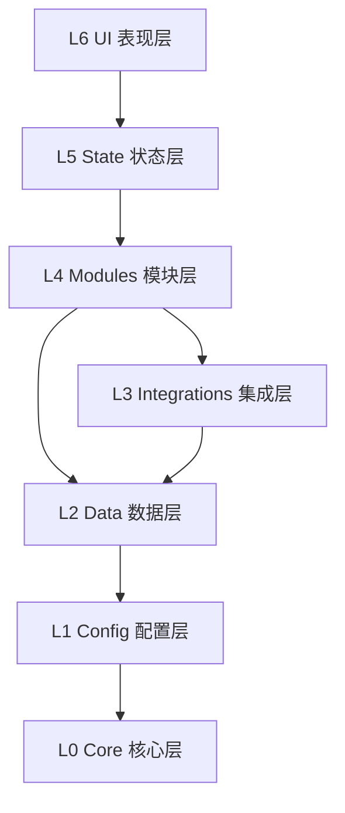

# Engram 项目文件架构

> 基于 **React + Vite + TypeScript** + **Tailwind CSS**
> **Version**: v0.9.9 (Layered Architecture)

---

# Engram 项目文件架构

> 基于 **React + Vite + TypeScript** + **Tailwind CSS**
> **Version**: v0.9.9 (Layered Modular Architecture)

---

## 1. 顶层架构概览 (High-Level Overview)

```
src/
├── core/                  # [L0] 核心层：基础类型、事件总线、工具库
├── config/                # [L1] 配置层：设置管理 (SettingsManager)
├── data/                  # [L2] 数据层：IndexedDB 定义与聊天管理
├── integrations/          # [L3] 集成层：外部系统适配 (SillyTavern, LLM)
├── modules/               # [L4] 模块层：核心业务逻辑单元
│   ├── batch/             # 批处理
│   ├── memory/            # 记忆管理 (Extract, Summarize, Trim)
│   ├── preprocessing/     # 输入预处理
│   ├── rag/               # Graph RAG 检索
│   ├── search/            # 搜索服务 (暂留)
│    └── workflow/          # 任务流编排
        ├── core/          # 工作流引擎核心 (Engine, Step, JobContext)
        ├── definitions/   # 预定义工作流 (Entity, Summary, Preprocess)
        ├── processors/    # 文本/正则处理器
        └── steps/         # 原子步骤库
            ├── context/       # 上下文获取 (Chat, WorldInfo, Prompt)
            ├── execution/     # 外部执行 (LLM Request)
            ├── interaction/   # 用户交互 (Review)
            ├── persistence/   # 持久化 (Save Entity/Event)
            └── processing/    # 数据处理 (JSON Parse, Regex)
├── state/                 # [L5] 状态层：Zustand Store
└── ui/                    # [L6] 表现层：React 组件与视图
```

---

## 2. 详细目录结构 (Detailed Structure)

### 2.1 [L0] Core Layer (`src/core`)
系统最底层的契约，不依赖任何其他层级。

```
src/core/
├── events/                # 事件总线定义
├── logger/                # 日志系统
├── types/                 # 全局类型定义
├── updater/               # 更新检查器
└── utils/                 # 通用工具函数
```

### 2.2 [L1] Config Layer (`src/config`)
负责配置的定义、默认值和读写。

```
src/config/
├── settings.ts            # SettingsManager (对接 extension_settings)
└── types/                 # 配置接口定义
    ├── defaults.ts        # 默认值聚合
    ├── rag.ts             # RAG 相关配置
    └── prompt.ts          # 提示词模板配置
```

### 2.3 [L2] Data Layer (`src/data`)
负责数据的本地持久化存储。

```
src/data/
├── db.ts                  # Dexie 数据库定义 (EngramDB)
├── ChatManager.ts         # 聊天会话生命周期管理
├── cleanup/               # 数据清理服务
├── repositories/          # 数据仓储层 (Repository Pattern)
└── sync/                  # 数据同步服务
```

### 2.4 [L3] Integrations Layer (`src/integrations`)
防腐层，隔离外部依赖变换。

```
src/integrations/
├── tavern/                # SillyTavern 宿主适配
│   ├── bridge.ts          # Window 对象桥接
│   ├── context.ts         # 上下文获取 (Chat, Character)
│   ├── macros.ts          # 宏注册服务
│   ├── events.ts          # 酒馆事件监听
│   └── api/               # 宿主 API 封装 (Message, WorldInfo)
└── llm/                   # LLM 服务适配
    ├── Adapter.ts         # LLM 统一调用适配器
    └── SystemPrompts/     # 内置提示词文件 (.md)
```

### 2.5 [L4] Modules Layer (`src/modules`)
核心业务逻辑，按功能垂直切分。

```
src/modules/
├── batch/                 # 批处理系统
│   └── BatchProcessor.ts  # 任务队列处理器
├── memory/                # 记忆管理
│   ├── Summarizer.ts      # 剧情总结生成
│   ├── Trimmer.ts         # 记忆精简逻辑
│   ├── EventTrimmer.ts    # 精简服务门面
│   └── extractors/        # 信息提取器
│       ├── EntityExtractor.ts # 实体提取 (原 EntityBuilder)
│       └── TextProcessor.ts   # 文本处理
├── preprocessing/         # 输入预处理
│   ├── Preprocessor.ts    # 预处理主控
│   └── OutputParser.ts    # 输出解析
└── rag/                   # 检索增强生成
    ├── retrieval/         # 召回策略 (Retriever, HybridScorer)
    ├── embedding/         # 向量化服务 (EmbeddingService)
    └── injection/         # 上下文注入 (Injector)
```

### 2.6 [L5] State Layer (`src/state`)
UI 状态管理，作为 MVC 中的 Controller。

```
src/state/
├── memoryStore.ts         # 核心记忆状态 (CRUD, 过滤, 排序)
├── devLogStore.ts         # 开发日志状态
├── themeStore.ts          # 主题与外观状态
└── index.ts               # 状态导出
```

### 2.7 [L6] UI Layer (`src/ui`)
React 视图与交互组件。

```
src/ui/
├── assets/                # 静态资源 (Icons, GlobalStyles)
├── components/            # 通用组件库
│   ├── ui/                # 原子组件
│   └── layout/            # 布局组件
├── hooks/                 # 业务 Hooks
│   ├── useConfig.ts       # 配置管理
│   ├── useWorkflow.ts     # 工作流状态
│   ├── useWorldInfo.ts    # 世界书管理
│   └── useRag.ts          # RAG 交互
└── views/                 # 页面视图
    ├── dashboard/         # 概览仪表盘
    ├── processing/        # 处理面板
    ├── memory-stream/     # 记忆流可视化
    └── api-presets/       # API 与提示词配置
        └── components/    # 配置组件
            ├── WorldbookProfileList.tsx # 知识库方案列表
            └── WorldbookProfileForm.tsx # 知识库方案编辑
```

---

## 🛠️ 模块职责详解

### `core/` - 核心层
整个系统的基石，定义了数据流动的基本契约。
- **Events**: 定义了应用内通信的事件类型。
- **Types**: 包含跨层级使用的通用接口定义。

### `config/` - 配置层
负责应用配置的定义、默认值和持久化读写。
- **SettingsManager**: 统一管理扩展配置的读写，对接 SillyTavern 的 `extensionSettings`。

### `data/` - 数据层
负责数据的本地持久化。
- **EngramDB**: 基于 Dexie.js 的 IndexedDB 封装。
- **ChatManager**: 管理当前聊天会话的状态和元数据。

### `integrations/` - 集成层
充当防腐层 (Anti-Corruption Layer)，隔离外部系统变化对核心逻辑的影响。
- **Tavern**: 封装 SillyTavern 的全局变量和 API 调用。
- **LLM**: 封装不同 LLM 后端的调用差异，提供统一的 `generate` 接口。

### `modules/` - 模块层 (业务核心)
包含独立的功能模块，每个模块由 `index.ts` 导出公共 API。

| 模块 | 职责 | 关键导出 |
|------|------|----------|
| **rag** | 检索增强生成 | `Retriever`, `VectorService`, `Reranker` |
| **summarizer** | 剧情总结 | `SummarizerService`, `SummaryWorker` |
| **preprocessing** | 输入预处理 | `Preprocessor`, `OutputParser` |
| **graph** | 实体与图谱 | `EntityBuilder`, `GraphService` |
| **batch** | 批处理任务 | `BatchProcessor`, `BatchQueue` |

### `state/` - 状态层
连接业务逻辑与 UI，使用 Zustand 实现响应式状态管理。
- **memoryStore**: 应用的核心状态仓库，UI 组件通过 Hooks 订阅此处的变更。

### `ui/` - 表现层
基于 React 的用户界面，采用原子化组件设计。
- **hooks**: 封装 UI 交互逻辑，如 `useConfig` (配置管理), `useWorkflow` (批处理状态)。
- **views**: 对应侧边栏的不同功能面板。

---

## 🏗️ 分层依赖规则

系统遵循严格的单向依赖原则：

1. **上层可依赖下层**：`ui` -> `state` -> `modules` -> `integrations` -> `data` -> `config` -> `core`
2. **同层原则上互不依赖**：模块之间应保持独立，通过 `core/events` 进行通信。
3. **下层不可依赖上层**：例如 `modules` 不能导入 `ui` 或 `state` 中的代码。
4. **跨层穿透**：`ui` 层可以直接使用 `core` 和 `config` 中的类型和常量。



---

## 🔌 关键服务索引

| 服务名称 | 新位置 | 原位置 (v0.8) |
|----------|--------|---------------|
| `SettingsManager` | `src/config/settings.ts` | `services/settings/Persistence.ts` |
| `SummarizerService` | `src/modules/summarizer/SummarizerService.ts` | `services/summarizer/SummarizerService.ts` |
| `LLMAdapter` | `src/integrations/llm/Adapter.ts` | `services/api/LLMAdapter.ts` |
| `ChatManager` | `src/data/ChatManager.ts` | `services/database/ChatManager.ts` |
| `Preprocessor` | `src/modules/preprocessing/Preprocessor.ts` | `services/preprocessing/Preprocessor.ts` |
| `Retriever` | `src/modules/rag/retrieval/Retriever.ts` | `services/rag/Retriever.ts` |
