# Engram 项目文件架构

> 基于 **React + Vite + TypeScript** + **Tailwind CSS**，采用分层架构设计。
> **最后更新**: 2026-01-08 (V0.5 Pipeline 架构优化)

---

## 📁 目录结构

```
src/
├── assets/                # 静态资源
│   ├── icons/             # SVG 图标组件 (EngramIcon, EngramTextLogo)
│   └── styles/            # 全局样式组件 (GlobalStyles)
│
├── components/            # 纯展示组件
│   ├── ui/                # 原子组件 (Button, Switch, Modal, TabPills)
│   ├── layout/            # 布局组件 (MainLayout, Header, Sidebar)
│   ├── visual/            # 视觉组件 (NeuralOrb, WelcomeAnimation)
│   └── common/            # 通用组件 (ItemCard, ItemList, PageTitle)
│
├── lib/                   # 无业务逻辑的工具库 (L5 基础层)
│   ├── logger/            # 日志系统 (Logger, ModelLogger)
│   ├── EventWatcher.ts    # [V0.5] 通用事件监听器 (可被多模块共用)
│   └── events.ts          # 应用内部事件总线
│
├── services/              # 核心业务逻辑 ⭐ (详见下方)
│
├── stores/                # [V0.5] Zustand 状态库 (L3 状态层)
│   ├── memoryStore.ts     # 记忆状态管理 (DB/WB 读写)
│   ├── devLogStore.ts     # 开发日志状态
│   └── themeStore.ts      # 主题状态
│
├── tavern/                # SillyTavern 适配层 ⭐ (L5 基础层)
│   ├── bridge.ts          # 唯一的 window.SillyTavern 入口
│   ├── context.ts         # ST 上下文获取 (getSTContext)
│   ├── TavernEvents.ts    # 酒馆事件封装
│   ├── WorldBookState.ts  # @deprecated V0.5 已废弃
│   ├── MacroService.ts    # 全局宏注册 ({{engramSummaries}} 等)
│   └── api/               # 酒馆 API 封装
│       ├── Message.ts     # 消息服务
│       ├── WorldInfo.ts   # 世界书服务
│       └── index.ts       # 统一导出
│
├── types/                 # 类型定义
│   ├── global.d.ts        # Window 扩展声明
│   └── st-types/          # SillyTavern 类型 (23个 .d.ts)
│
├── views/                 # 页面级视图
│   ├── Dashboard/         # 仪表盘
│   ├── Processing/        # 处理 (总结/精简)
│   ├── APIPresets/        # API 配置
│   ├── Settings/          # 设置
│   ├── DevLog/            # 开发日志
│   ├── Graph/             # 图谱可视化
│   └── MemoryStream/      # 记忆流
│
├── hooks/                 # React Hooks
├── contexts/              # React Context (ThemeContext)
├── constants/             # 常量配置 (navigation, commands)
├── styles/                # 样式 (main.css, themes.ts)
├── utils/                 # 工具函数
│
├── App.tsx                # 根组件 (支持懒加载)
└── index.tsx              # 入口
```

---

## 🛠️ Services 模块详解

### `services/api/` - LLM API 层
**通用 LLM 调用和配置管理**

| 文件 | 导出 | 用途 |
|------|------|------|
| `LLMAdapter.ts` | `LLMAdapter`, `llmAdapter` | 封装 TavernHelper LLM 调用，支持 `generate` / `generateRaw` |
| `types.ts` | 各种类型定义 | `LLMPreset`, `PromptTemplate`, `VectorConfig`, `EngramAPISettings` 等 |
| `ModelDiscovery.ts` | `ModelDiscovery` | 模型发现和列表获取 |
| `prompts/` | 内置提示词模板 | `text_summary.md`, `trim.md`, `query_enhance.md`, `vector_summary.md` |

**复用示例**：
```typescript
import { llmAdapter, LLMRequest } from '@/services/api';
const response = await llmAdapter.generate({ systemPrompt, userPrompt });
```

---

### `services/pipeline/` - 数据处理管道
**通用文本处理组件，可被多个模块复用**

| 文件 | 导出 | 用途 |
|------|------|------|
| `TextProcessor.ts` | `TextProcessor`, `textProcessor` | LLM 输出清洗、截断、格式化 |
| `RegexProcessor.ts` | `RegexProcessor`, `regexProcessor`, `RegexRule` | 可配置正则规则处理（输入/输出清洗） |
| `Pipeline.ts` | `Pipeline` | ETL 流水线控制器 [框架占位] |

**复用示例**：
```typescript
import { textProcessor, regexProcessor } from '@/services/pipeline';
const cleaned = textProcessor.clean(llmOutput);
const processed = regexProcessor.process(text, 'output');
```

---

### `services/summarizer/` - 总结服务
**剧情总结核心业务逻辑**

| 文件 | 导出 | 用途 |
|------|------|------|
| `SummarizerService.ts` | `SummarizerService`, `summarizerService` | 一层总结：楼层监听、LLM 调用、世界书写入 |
| `TrimmerService.ts` | `TrimmerService`, `trimmerService` | 二层总结：合并精简多条摘要 |
| `types.ts` | 配置和状态类型 | `SummarizerConfig`, `TriggerMode`, `SummaryResult` 等 |

> **注**：`SummarizerService` 和 `TrimmerService` 内部使用 `api/LLMAdapter` 和 `pipeline/*` 组件

---

### `services/settings/` - 设置持久化
**与 SillyTavern extensionSettings 交互**

| 文件 | 导出 | 用途 |
|------|------|------|
| `Persistence.ts` | `SettingsManager` | 所有 Engram 设置的读写、持久化 |

**常用方法**：
- `SettingsManager.get('apiSettings')` - 获取 API 配置
- `SettingsManager.set(key, value)` - 保存设置
- `SettingsManager.getEnabledPromptTemplate('text_summary')` - 获取启用的提示词模板

---

### 其他服务模块

| 目录 | 状态 | 用途 |
|------|------|------|
| `services/database/` | ✅ 可用 | Dexie IndexedDB 数据库，ScopeManager 作用域管理 |
| `services/rag/` | ✅ **已实现** | Retriever (检索), Injector (动态注入) |
| `services/types/` | ✅ 可用 | 数据结构类型 (EventNode, Scope, EntityNode) |
| `services/memory/` | 🔲 占位 | 未来记忆管理 |
| `services/updater/` | ✅ 可用 | 版本更新检查 |
| `services/NotificationService.ts` | ✅ 可用 | Toast 通知服务 |
| `services/ThemeManager.ts` | ✅ 可用 | 主题管理 |
| `services/RevisionService.ts` | ✅ 可用 | 总结修订服务 |
| `services/CharacterDeleteService.ts` | ✅ 可用 | 角色删除联动清理 |

---

## 🏗️ 分层架构

系统采用单向依赖流，严禁跨层循环依赖。

```mermaid
graph TD
    L1_UI[L1: 表现层 views/] --> L2_Hook[L2: 应用层 hooks/]
    L1_UI --> L3_Store[L3: 状态层 stores/]
    L2_Hook --> L3_Store
    L2_Hook --> L4_Service[L4: 业务层 services/]
    L4_Service --> L5_Infra[L5: 基础设施层 lib/ & tavern/]
    L4_Service --> L5_DB[database/]
```



| 层级 | 目录 | 职责 | 依赖规则 |
|------|------|------|----------|
| **L1 表现层** | `views/`, `components/` | UI 渲染，交互事件 | 可调用 hooks, stores |
| **L2 应用层** | `hooks/` | 将业务逻辑封装为 React API | 可调用 stores, services |
| **L3 状态层** | `stores/` | 全局状态管理 (Zustand) | 可调用 services |
| **L4 业务层** | `services/` | 核心业务逻辑，纯 TS | 可调用 lib, tavern |
| **L5 基础层** | `lib/`, `tavern/` | 底层工具，外部 API 适配 | **不可依赖上层** |

---

## 📐 编码规范

### 业务逻辑提取到 Hooks

```tsx
// ❌ 错误：视图包含业务逻辑
const APIPresets = () => {
    const [settings, setSettings] = useState(...);
    const handleAdd = () => { /* 复杂逻辑 */ };
}

// ✅ 正确：逻辑在 Hook 中
const APIPresets = () => {
    const { settings, addPreset } = useAPIPresets();
}
```

### 样式规范

- **使用 Tailwind 主题类**：`bg-background`, `text-foreground`, `border-border`
- **禁止硬编码颜色**：不使用 `bg-black`, `text-zinc-*` 等
- **共享样式**：在 `main.css` 的 `@layer components` 中定义

---

## 🔌 关键模块说明

### tavern/context.ts
**唯一的 SillyTavern 上下文获取入口**：
- `getSTContext()` - 获取 ST 上下文
- `getCurrentChat()` - 获取聊天记录
- `getCurrentCharacter()` - 获取当前角色
- `isSTAvailable()` - 检查可用性

### tavern/MacroService.ts
**全局宏注册服务** (V0.4 新增)：
- `{{engramSummaries}}` - 获取当前角色的所有 Engram 摘要内容
- `{{engramContext}}` - 动态上下文 (RAG 检索结果)

### Hooks 目录
| Hook | 功能 |
|------|------|
| `useAPIPresets` | API 预设 CRUD、提示词模板、正则规则管理 |
| `useDevLog` | 日志订阅、过滤、导出 |

---

## 📊 构建产物

```
dist/
├── index.js           # 主 JS 包
├── style.css          # 样式
└── *.js               # 代码分割的 chunks
```

构建命令：`npm run build`
